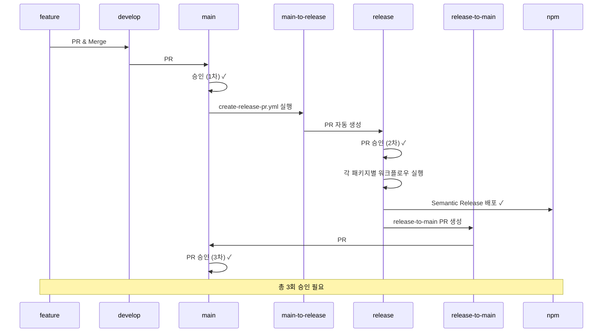
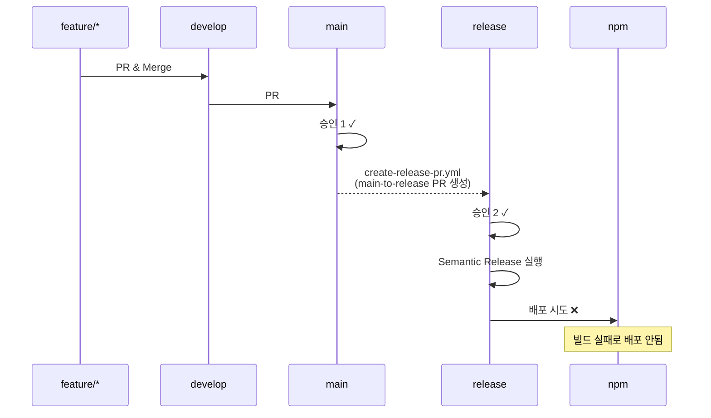
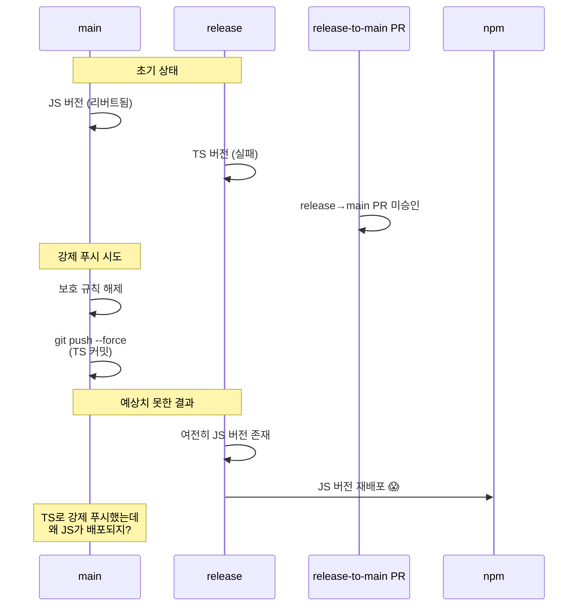
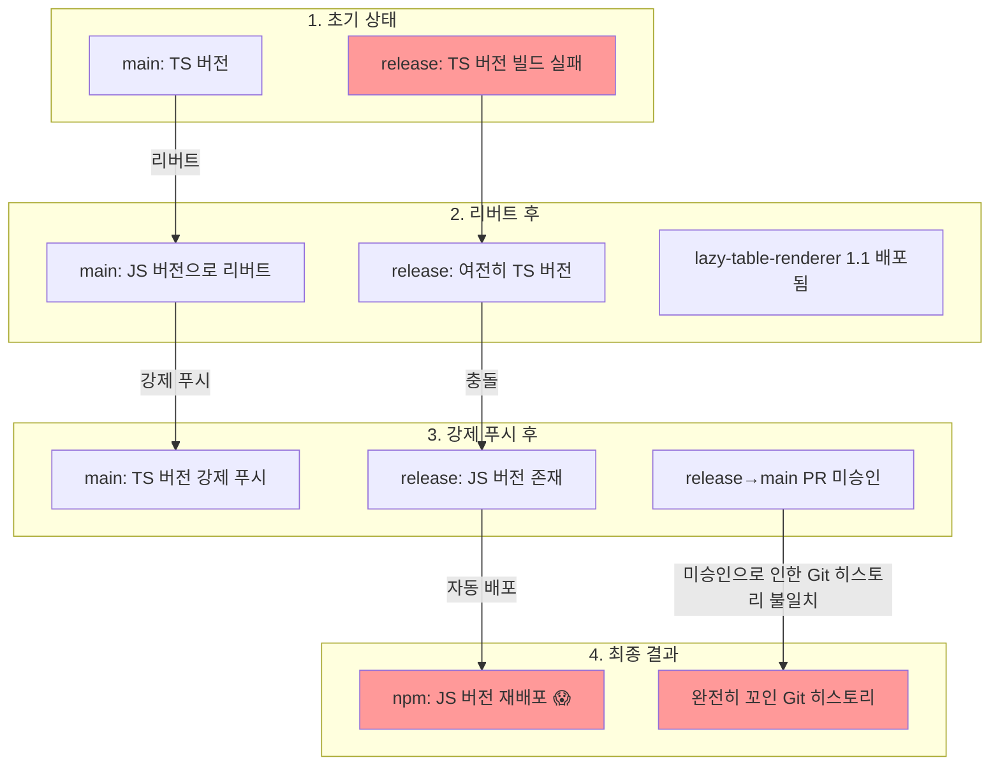
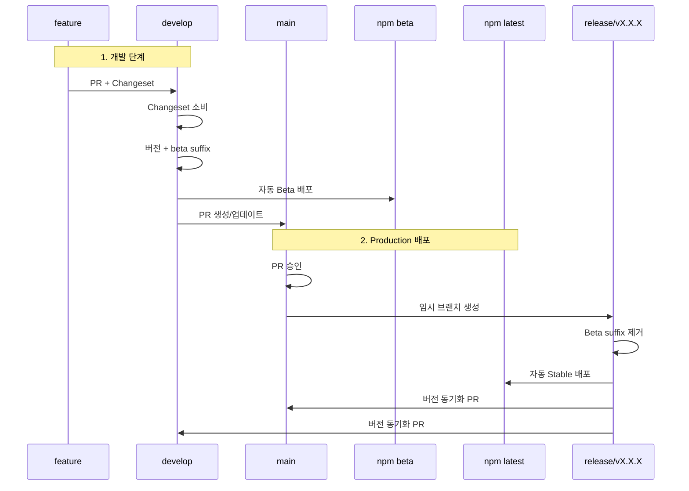
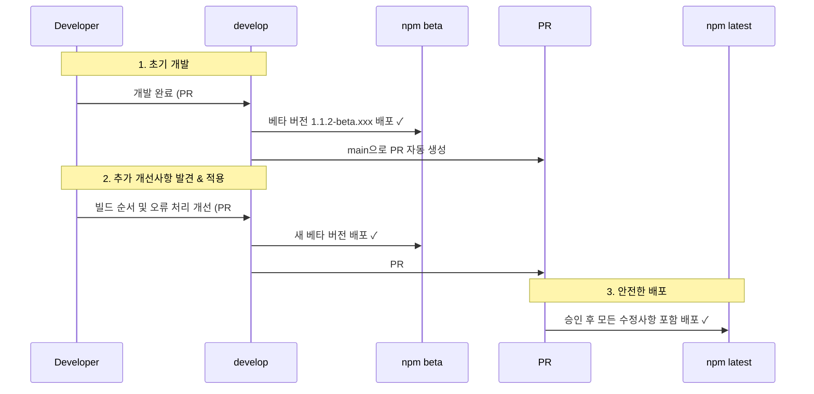
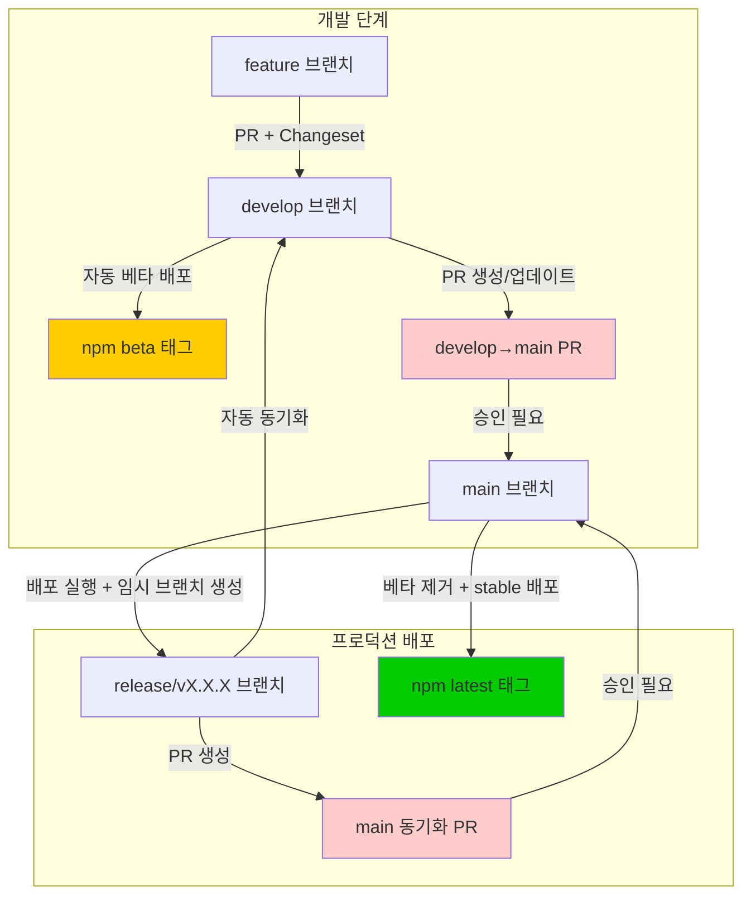

TypeScript 마이그레이션 실패를 통해 배운 모노레포 배포 워크플로우 개선 사례: Beta/Stable 2단계 배포와 Changesets 도입으로 안전한 배포 시스템 구축기
<!--more-->

## 시작: 평범한 TypeScript 마이그레이션이 대참사로

vue3-pivottable 프로젝트를 TypeScript로 마이그레이션하던 날이었습니다. "메인 패키지만 먼저 배포하고 하위 패키지는 나중에 수정하지 뭐" 라고 생각했던 것이 화근이었습니다.

## 첫 번째 실수: 빌드 실패를 무시하다

```
✓ vue-pivottable 빌드 성공
✗ plotly-renderer 빌드 실패
✗ lazy-table-renderer 빌드 실패

"아 하위 패키지는 나중에 고치면 되겠지..."
```

### 당시 워크플로우 (실제 파일 분석)

**관련 워크플로우:**

- create-release-pr.yml (main → release 동기화)
- release-vue-pivottable.yml (메인 패키지)
- release-plotly-renderer.yml (하위 패키지)
- release-lazy-table-renderer.yml (하위 패키지)

#### 성공하는 경우



#### 실패한 경우 (TypeScript 마이그레이션)



main 브랜치에서 release 브랜치로 동기화 후 배포가 실행되는데, 빌드가 실패해서 배포가 안 되었습니다.

## 두 번째 실수: 리버트의 함정

"그럼 리버트하면 되겠네?"

PR에서 리버트를 실행했더니 main이 업데이트되고 다시 배포가 시작되었습니다. 그런데...

```
배포 성공!
그런데... lazy-table-renderer 버전이 1.0.x → 1.1로?
왜 이 패키지만 버전이 올라갔지? 🤔
```

**실제 상황**: TypeScript 마이그레이션 PR에 lazy-table-renderer 변경사항이 포함되어 있었고, Semantic Release가 이를 감지하여 버전을 올렸습니다.

## GitHub App으로 보호 규칙 우회 시도 (PR #178-189)

### 왜 GitHub App?

"보호된 main 브랜치에 직접 푸시할 수 있다면 얼마나 편할까?"

이 생각으로 12개의 PR을 만들어 GitHub App 토큰으로 보호 규칙을 우회하려고 시도했습니다.

### 시도 과정 (30분 간격으로 연속 시도)

```yaml
# PR #178: APP_INSTALLATION_ID 테스트
# PR #179: APP_ID 1254720으로 수정
# PR #180: 시크릿 길이 디버그
# PR #181: 공식 action으로 변경
# PR #182: PRIVATE_KEY 형식 수정
# PR #183-188: Private Key 형식 검증
# PR #189: APP_ID 재확인
```

### 결론: GitHub의 보안 철학

**GitHub App 토큰도 브랜치 보호 규칙을 우회할 수 없습니다!**

이것은 의도적인 설계입니다:

- Personal Access Token ❌
- GitHub App Token ❌  
- OAuth Token ❌
- GITHUB_TOKEN ❌

모든 종류의 토큰이 브랜치 보호 규칙을 준수해야 합니다.

## 세 번째 실수: 강제 푸시의 나비효과

이제 완전히 꼬이기 시작했습니다. release→main PR이 미승인 상태로 남아있어서 강제 푸시가 더 큰 참사를 일으켰습니다:



"에라 모르겠다. 보호 규칙 끄고 강제 푸시!"

```bash
git push --force origin <ts-commit>:main
```

결과: release→main PR이 미승인이라 release 브랜치의 JS 버전이 다시 배포되었습니다. 😱

## 완전히 꼬인 상황



결국 GitHub Actions를 모두 삭제하고 처음부터 다시 시작했습니다.

## 개선된 워크플로우: 실패해도 괜찮은 환경 만들기

### 핵심 개선사항

#### 1. Beta/Stable 2단계 배포



#### 2. Changesets로 명시적 버전 관리

```yaml
# 어떤 패키지를 변경했나요?
- vue-pivottable

# 어떤 종류의 변경인가요?
- minor
```

더 이상 커밋 메시지로 추측하지 않습니다.

#### 3. 패키지 독립성 보장

```json
{
  "linked": [], // 연결된 패키지 없음
  "fixed": [] // 고정 버전 없음
}
```

lazy-table-renderer가 멋대로 버전 업되는 일이 없어졌습니다.

#### 4. release 브랜치 전략 변경

- 이전: 영구적인 release 브랜치 (꼬일 수 있음)
- 현재: 임시 release/vX.X.X 브랜치 (배포 후 삭제 가능)

#### 5. 디버깅 및 분석 역량 개선

1. **빈 태그 'v' 오류**

   ```yaml
   # 문제: id가 없어서 ${{ steps.version.outputs.version }}이 비어있음
   - name: Version packages as beta
     # id: version <- 이게 없었음!
   ```

2. **베타 버전 중복 (1.1.1-beta.123-beta.456)**

   ```bash
   # 문제: 마지막 베타만 제거
   sed 's/-beta\.[0-9]*$//' 
   
   # 해결: 모든 베타 제거
   sed 's/-beta\.[0-9]*//g'
   ```

3. **빌드 순서 문제**

   ```bash
   # 문제: 하위 패키지가 메인 패키지 타입에 의존
   pnpm -r build  # 모든 패키지 동시 빌드
   
   # 해결: 순차적 빌드
   pnpm build  # 메인 먼저
   pnpm -r --filter './packages/*' build  # 하위 패키지
   ```

4. **실패 감지 문제**

   ```bash
   # 문제: 빌드 실패해도 계속 진행
   pnpm build || true
   
   # 해결: 실패 시 즉시 중단
   set -e
   pnpm build
   ```

#### 6. 코드 품질 게이트 (컮밋 전 검사)

```json
// .husky/pre-commit
#!/usr/bin/env sh
. "$(dirname -- "$0")/_/husky.sh"

pnpm lint-staged
```

- **커밋 전 자동 수정**: ESLint + Prettier
- **빠른 피드백**: 변경된 파일만 검사
- **일관된 코드 품질**: 모든 개발자 동일 규칙

### 개선된 워크플로우 실증: PR #194, #195 사례

베타 배포 후 추가 업데이트가 필요한 상황이 실제로 발생했지만, 새로운 워크플로우로 안전하게 처리되었습니다:



#### 핵심 차이점

**과거 (문제 발생):**

- 추가 변경사항 → 수동으로 모든 것 다시 처리
- 복잡한 Git 수술 필요
- 어떤 변경사항이 포함되었는지 추적 어려움

**현재 (안전한 해결):**

- 추가 변경사항 → PR이 자동으로 최신 상태 유지
- 베타에서 모든 변경사항 검증 완료
- Stable 사용자는 모든 개선사항이 포함된 완성본만 받음

## 실제 효과

### Before: 공포의 배포

- 배포 = 러시안 룰렛
- 실패 시 전체 사용자 영향
- 복잡한 Git 수술 필요

### After: 안전한 배포

- Beta에서 먼저 테스트
- 실패해도 Stable 사용자 안전
- 명확한 롤백 경로

## 주요 교훈

1. **실패를 격리하라**

   - Beta 단계는 "실패해도 괜찮은" 안전망

2. **암묵적 → 명시적**

   - Semantic Release의 커밋 추측 → Changesets의 명시적 선언

3. **복잡성을 줄여라**

   - 영구 release 브랜치 → 임시 브랜치
   - 복잡한 다중 워크플로우 → 명확한 3개 워크플로우

4. **자동화는 단순해야 한다**
   - 복잡한 자동화는 디버깅이 어렵다

## 최종 워크플로우: 안전한 배포 시스템



### 핵심 개선사항 대비표

| 구분 | 이전 (문제 발생) | 현재 (개선됨) |
|------|-----------------|-------------|
| 배포 단계 | 단일 (release → npm) | 2단계 (develop→beta, main→stable) |
| 실패 영향 | 전체 사용자 | 베타 사용자만 |
| 버전 관리 | 커밋 메시지 추측 | Changesets 명시적 선언 |
| 브랜치 전략 | 영구 release | 임시 release/vX.X.X |
| 빌드 순서 | 동시 (의존성 문제) | 순차 (main → sub) |
| 품질 검사 | CI 후 발견 | Husky 전 차단 |

## 마무리

TypeScript 마이그레이션 실패는 뼈아픈 경험이었지만, 덕분에 더 나은 워크플로우를 만들 수 있었습니다.

현재 패키지들은 안정적으로 배포되고 있습니다:

- vue-pivottable (메인 패키지)
- @vue-pivottable/plotly-renderer
- @vue-pivottable/lazy-table-renderer

이제는:

- **Beta 테스트**: `npm install vue-pivottable@beta`
- **문제 발견**: Stable 사용자는 안전
- **수정 후**: main 머지로 안전하게 배포

"실패해도 괜찮은" 환경을 만드는 것이 안정적인 배포의 핵심이었습니다.
