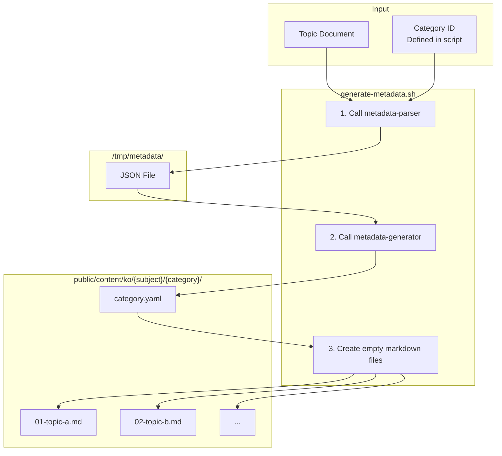

In the [previous post](/en/blog/2025/12/09/ai-agent-pipeline-1-why-learning-app/), I talked about why I started building a learning app.

This post covers **how I defined the content to generate**.

<!--more-->

## 1. Defining What to Automate

In the previous post, I decided to auto-generate learning content using LLM.

Then I need to first define **what to generate**.
JavaScript alone has dozens of topics, and each topic has detailed sub-topics.
How do I organize all of this?

The result of this deliberation is the **topic document**.

---

## 2. Topic Document Structure

The topic document has a 3-level structure: **Subject Document > Category > Topic**.

```
docs/topic/
├── javascript-core-concepts.md  ← Subject document (filename)
├── javascript-browser-concepts.md
├── css-core-concepts.md
├── ...
└── nextjs-advanced-concepts.md
```

### Real Example: javascript-core-concepts.md

```markdown
# JavaScript Core Concepts           ← Subject document title

## 📋 Detailed Concept List

### 1. Mastering Variables              ← Category (01-variables)
1. **What problems occur when using var?** - Function scope and hoisting issues  ← Topic
2. **How is let different from var?** - Block scope and TDZ                      ← Topic
3. **Is const really constant?** - Reassignment prohibition vs immutability      ← Topic
...
10. **How to enforce variable declaration?** - strict mode and variables         ← Topic

### 2. JavaScript Type System      ← Category (02-type-system)
1. **How many types are in JavaScript?** - 7 primitive types and objects    ← Topic
2. **Why is decimal calculation weird?** - Floating point and precision     ← Topic
...
```

### 3-Level Structure and Overall Scale

| Level | Example | Description |
|:---:|:---|:---|
| **Subject Document** | javascript-core-concepts | Filename. 10 documents |
| **Category** | 1. Mastering Variables | 21-42 per subject document |
| **Topic** | What problems occur when using var... | 10 per category. **Expands to ~1,400 lines of content** |

Each topic is a **question-style title + one-line description**.
This one line expands to about 1,400 lines of content.

| Subject Document | Categories | Topics (×10) |
|:---|:---:|:---:|
| javascript-core-concepts | 42 | 420 |
| javascript-browser-concepts | 30 | 300 |
| css-core-concepts | 21 | 210 |
| css-advanced-concepts | 30 | 300 |
| html-core-concepts | 21 | 210 |
| html-advanced-concepts | 25 | 250 |
| ... | ... | ... |
| **Total** | **169 + α** | **1,690 + α** |

The overall scale is 6 + α subject documents, **169 + α categories**, **1,690 + α topics**.

---

## 3. Metadata Pipeline: First Automation

Now the topics are defined. But I need to pass them to the LLM to create documents for each topic.

The problem is that the topic document only contains Korean titles like "What problems occur when using var?". To show lists in the app, I need detailed descriptions, and information like difficulty, tags, and estimated learning time. I also need to convert these titles to filenames like `01-var-problems.md`.

JavaScript Core Concepts (javascript-core-concepts.md) alone has 420 topics. I can't manually define this information for each topic.
This was the first automation target.

### Pipeline Structure



### metadata-parser Agent

This is the first agent. It reads 10 topics per category from the topic document, extracts IDs and descriptions from Korean titles for filenames, and saves them as JSON.

**Full Prompt:**

```markdown
---
name: metadata-parser
description: When topic definition files need parsing to extract structured metadata
tools: Read, Write, Bash
model: sonnet
---

You are a metadata parser that creates JSON files with topic metadata.

## Input Format
"Parse topics for {majorSubject}, category {categoryId}"

## Process
1. Read `docs/topic/{majorSubject}.md`
2. Find the category section matching {categoryId}
3. Parse the 10 topics
4. Save the JSON result to `/tmp/metadata/{majorSubject}-{categoryId}.json`

## JSON File Format
{
  "success": true,
  "majorSubject": "...",
  "categoryId": "...",
  "totalTopics": 10,
  "topics": [
    {
      "number": 1,
      "id": "01-topic-name",
      "title": "Korean Title?",
      "description": "Korean Description"
    }
  ]
}

## ID Generation Rules
- "React는 무엇이고..." → "01-what-is-react"
- "Virtual DOM은..." → "02-virtual-dom"
- Use zero-padded numbers and kebab-case
```

**Output Example:**

```json
{
  "success": true,
  "majorSubject": "javascript-core-concepts",
  "categoryId": "01-variables",
  "totalTopics": 10,
  "topics": [
    {
      "number": 1,
      "id": "01-var-problems",
      "title": "var를 사용하면 어떤 문제가 발생할까?",
      "description": "함수 스코프와 호이스팅 문제"
    },
    ...
  ]
}
```

This JSON contains the ID, title, and description for each topic. But to use it in the app, I need additional information like difficulty and tags. The next agent, metadata-generator, enriches this.

### metadata-generator Agent

This is the second agent. It reads the JSON saved by metadata-parser, expands descriptions, and adds difficulty, tags, and estimated learning time to create category.yaml.

**Full Prompt:**

```markdown
---
name: metadata-generator
description: When category.yaml files need complete metadata generation for learning topics
tools: Read, Write, MultiEdit, Bash
model: sonnet
---

You are a metadata generator that creates comprehensive category.yaml files for learning content.

## Single Purpose
Transform parsed topic data into complete, well-structured category.yaml files with all required metadata fields.

## Input

**Required**: Must read and process JSON files saved by metadata-parser.

**File path**: `/tmp/metadata/{majorSubject}-{categoryId}.json`

**Prompt format**:
"Generate category.yaml for {majorSubject}/{categoryId}"

**Required processing order**:
1. Extract majorSubject and categoryId from prompt
2. **Use Read tool** to read `/tmp/metadata/{majorSubject}-{categoryId}.json` file
3. Parse JSON and extract topics array
4. If `"success": true`, generate category.yaml
5. If `"success": false`, output error message
6. **Use Write tool** to save category.yaml file

## Category Metadata Generation

### 1. Extract Category Information
From the categoryId (e.g., "01-variables"):
- **id**: Semantic ID generation rule
  - Remove number + meaningful suffix
  - 01-variables → variables-basics
- **path**: Keep original categoryId (e.g., "01-variables")
- **title**: Korean title with order number (e.g., "1. JavaScript 변수 완전 정복")
- **order**: Extract prefix number (01 → 1)

## Topic Metadata Enhancement

### For Each Topic, Generate:

1. **Expand Description**
   - Input: "함수 스코프와 호이스팅 문제"
   - Output: "var 키워드의 함수 스코프와 호이스팅으로 인한 문제점을 이해하고 해결 방법을 학습합니다"

2. **Extract Meaningful Tags**
   From title "var를 사용하면 어떤 문제가 발생할까?":
   - Extract: ["var", "호이스팅", "함수 스코프", "문제점"]

3. **Assign Difficulty**
   - beginner: 기초, 소개, 기본
   - intermediate: 비교, 차이점, 활용
   - advanced: 최적화, 패턴, 고급

4. **Set Estimated Time**
   - Default: 15 minutes per topic

## File Operations

### Required operation order:

1. **Read JSON file** (Use Read tool)
2. **Create directory** (Use Bash tool):
   mkdir -p public/content/ko/{majorSubject}/{categoryId}/
3. **Create category.yaml** (Use Write tool):
   Path: `public/content/ko/{majorSubject}/{categoryId}/category.yaml`

**Important**: Do not read docs/topic/*.md files directly. Must get data from JSON files.
```

**Output Example:**

```yaml
id: variables-basics
path: 01-variables
title: 1. Mastering Variables
description: Master everything about JavaScript variables
order: 1
difficulty: beginner
estimatedTime: 150
topics:
  - id: 01-var-problems
    title: var를 사용하면 어떤 문제가 발생할까?
    description: Learn about function scope and hoisting issues with var keyword
    order: 1
    difficulty: beginner
    tags: [var, hoisting, function scope]
  ...
```

Now the metadata for the app is ready. Finally, a shell script reads this category.yaml and creates empty content files.

### Shell Script: Creating Empty Content Files

The shell script reads category.yaml and creates 10 empty markdown files.
Each file contains frontmatter and status tracking comments.

```markdown
---
id: 01-var-problems
title: var를 사용하면 어떤 문제가 발생할까?
description: Function scope and hoisting issues
difficulty: beginner
estimatedTime: 15
category: javascript-core-concepts
subcategory: 01-variables
order: 1
tags:
  - var
  - hoisting
---

<!--
CURRENT_AGENT: overview-writer
STATUS: IN_PROGRESS
STARTED: 2024-10-10T10:30:00+09:00
HANDOFF LOG:
[START] pipeline | Content generation started
[DONE] content-initiator | File initialized
-->
```

The agent prompts were written using [meta-prompting](https://www.promptingguide.ai/techniques/meta-prompting). I explained the role and input/output to Claude, asked it to create prompts, and then improved them based on the results. The pipeline built this way worked without issues.

The next post will cover the learning content generation pipeline.

---

> This series shares experiences applying the AI-DLC (AI-Driven Development Lifecycle) methodology to a real project.
> For more details about AI-DLC, please refer to the [Economic Dashboard Development Series](/en/blog/2025/10/06/economic-dashboard-1-why-started/).
