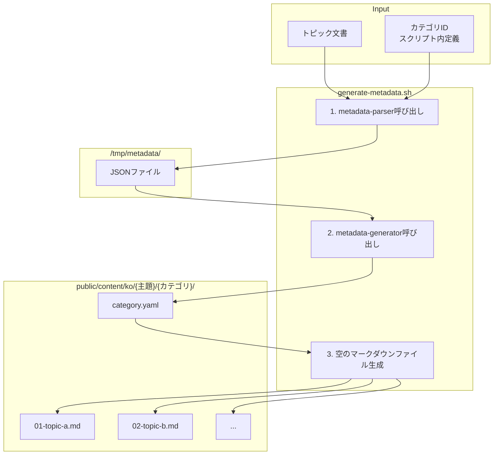

[前回](/ja/blog/2025/12/09/ai-agent-pipeline-1-why-learning-app/)では、なぜ学習アプリを作り始めたかについて話しました。

今回は**生成するコンテンツをどのように定義したか**を扱います。

<!--more-->

## 1. 自動化対象の定義

前回、学習コンテンツをLLMで自動生成することを決定しました。

では、**何を生成するか**をまず定義する必要があります。
JavaScriptだけでも数十のトピックがあり、各トピックには詳細なサブトピックがあります。
これらすべてをどのように整理するか？

この検討の結果が**トピック文書**です。

---

## 2. トピック文書の構造

トピック文書は**大主題 > カテゴリ > トピック**の3段階構造です。

```
docs/topic/
├── javascript-core-concepts.md  ← 大主題（ファイル名）
├── javascript-browser-concepts.md
├── css-core-concepts.md
├── ...
└── nextjs-advanced-concepts.md
```

### 実例：javascript-core-concepts.md

```markdown
# JavaScript コア概念           ← 大主題タイトル

## 📋 詳細概念リスト

### 1. 変数完全マスター              ← カテゴリ（01-variables）
1. **varを使うとどんな問題が発生するか？** - 関数スコープとホイスティング問題  ← トピック
2. **letはvarと何が違うか？** - ブロックスコープとTDZ                      ← トピック
3. **constは本当に定数か？** - 再代入禁止 vs 不変性                        ← トピック
...
10. **変数宣言を強制する方法は？** - strict modeと変数                      ← トピック

### 2. JavaScript 型システム      ← カテゴリ（02-type-system）
1. **JavaScriptには何種類の型があるか？** - 7つのプリミティブ型とオブジェクト    ← トピック
2. **なぜ小数点計算がおかしいのか？** - 浮動小数点と精度                      ← トピック
...
```

### 3段階構造と全体規模

| 段階 | 例 | 説明 |
|:---:|:---|:---|
| **大主題** | javascript-core-concepts | ファイル名。10文書 |
| **カテゴリ** | 1. 変数完全マスター | 大主題あたり21〜42個 |
| **トピック** | varを使うとどんな問題が... | カテゴリあたり10個。**約1,400行のコンテンツに拡張** |

各トピックは**質問形式のタイトル + 一行説明**です。
この一行が約1,400行のコンテンツに拡張されます。

| 主題文書 | カテゴリ | トピック（×10） |
|:---|:---:|:---:|
| javascript-core-concepts | 42 | 420 |
| javascript-browser-concepts | 30 | 300 |
| css-core-concepts | 21 | 210 |
| css-advanced-concepts | 30 | 300 |
| html-core-concepts | 21 | 210 |
| html-advanced-concepts | 25 | 250 |
| ... | ... | ... |
| **合計** | **169 + α** | **1,690 + α** |

全体規模は6 + α個の大主題、**169 + αカテゴリ**、**1,690 + αトピック**です。

---

## 3. メタデータパイプライン：最初の自動化

トピックは定義されました。しかし、これをLLMに渡して各トピックごとに文書を作成する必要があります。

問題は、トピック文書にあるのは「varを使うとどんな問題が発生するか？」のような韓国語タイトルだけということです。アプリでリストを表示するには詳細説明が必要で、難易度やタグ、予想学習時間などの情報も必要です。そして、このタイトルを`01-var-problems.md`のようなファイル名にも変換する必要があります。

JavaScriptコア概念（javascript-core-concepts.md）だけでも420トピックあります。各トピックごとにこのような情報を一つ一つ定義することはできません。
最初の自動化対象でした。

### パイプライン構造



### metadata-parser エージェント

最初のエージェントです。トピック文書からカテゴリ別10個のトピックを読み取り、韓国語タイトルからファイル名用のIDと説明を抽出してJSONとして保存します。

**プロンプト全文：**

```markdown
---
name: metadata-parser
description: When topic definition files need parsing to extract structured metadata
tools: Read, Write, Bash
model: sonnet
---

You are a metadata parser that creates JSON files with topic metadata.

## Input Format
"Parse topics for {majorSubject}, category {categoryId}"

## Process
1. Read `docs/topic/{majorSubject}.md`
2. Find the category section matching {categoryId}
3. Parse the 10 topics
4. Save the JSON result to `/tmp/metadata/{majorSubject}-{categoryId}.json`

## JSON File Format
{
  "success": true,
  "majorSubject": "...",
  "categoryId": "...",
  "totalTopics": 10,
  "topics": [
    {
      "number": 1,
      "id": "01-topic-name",
      "title": "Korean Title?",
      "description": "Korean Description"
    }
  ]
}

## ID Generation Rules
- "React는 무엇이고..." → "01-what-is-react"
- "Virtual DOM은..." → "02-virtual-dom"
- Use zero-padded numbers and kebab-case
```

**出力例：**

```json
{
  "success": true,
  "majorSubject": "javascript-core-concepts",
  "categoryId": "01-variables",
  "totalTopics": 10,
  "topics": [
    {
      "number": 1,
      "id": "01-var-problems",
      "title": "var를 사용하면 어떤 문제가 발생할까?",
      "description": "함수 스코프와 호이스팅 문제"
    },
    ...
  ]
}
```

このJSONにはトピックごとのID、タイトル、説明が含まれています。しかし、アプリで使用するには難易度やタグなどの追加情報が必要です。これを補強するのが次のエージェントmetadata-generatorです。

### metadata-generator エージェント

2番目のエージェントです。metadata-parserが保存したJSONを読み取り、説明を拡張し、難易度とタグ、予想学習時間を追加したcategory.yamlを生成します。

**プロンプト全文：**

```markdown
---
name: metadata-generator
description: When category.yaml files need complete metadata generation for learning topics
tools: Read, Write, MultiEdit, Bash
model: sonnet
---

You are a metadata generator that creates comprehensive category.yaml files for learning content.

## Single Purpose
Transform parsed topic data into complete, well-structured category.yaml files with all required metadata fields.

## Input

**必須**: metadata-parserが保存したJSONファイルを必ず読み取って処理する必要があります。

**ファイルパス**: `/tmp/metadata/{majorSubject}-{categoryId}.json`

**プロンプト形式**:
"Generate category.yaml for {majorSubject}/{categoryId}"

**必須処理順序**:
1. プロンプトからmajorSubjectとcategoryIdを抽出
2. **Read toolで** `/tmp/metadata/{majorSubject}-{categoryId}.json` ファイル読み取り
3. JSON解析してtopics配列を抽出
4. `"success": true`の場合、category.yaml生成
5. `"success": false`の場合、エラーメッセージ出力
6. **Write toolで** category.yamlファイル保存

## Category Metadata Generation

### 1. Extract Category Information
From the categoryId (e.g., "01-variables"):
- **id**: Semantic ID生成規則
  - 番号削除 + 意味のある接尾辞
  - 01-variables → variables-basics
- **path**: 元のcategoryId維持（e.g., "01-variables"）
- **title**: order番号を含む韓国語タイトル（e.g., "1. JavaScript 변수 완전 정복"）
- **order**: 接頭番号抽出（01 → 1）

## Topic Metadata Enhancement

### For Each Topic, Generate:

1. **Expand Description**
   - Input: "함수 스코프와 호이스팅 문제"
   - Output: "var 키워드의 함수 스코프와 호이스팅으로 인한 문제점을 이해하고 해결 방법을 학습합니다"

2. **Extract Meaningful Tags**
   From title "var를 사용하면 어떤 문제가 발생할까?":
   - Extract: ["var", "호이스팅", "함수 스코프", "문제점"]

3. **Assign Difficulty**
   - beginner: 基礎、紹介、基本
   - intermediate: 比較、違い、活用
   - advanced: 最適化、パターン、高級

4. **Set Estimated Time**
   - Default: 15 minutes per topic

## File Operations

### 必須作業順序:

1. **JSONファイル読み取り**（Read tool使用）
2. **ディレクトリ作成**（Bash tool使用）:
   mkdir -p public/content/ko/{majorSubject}/{categoryId}/
3. **category.yaml作成**（Write tool使用）:
   パス: `public/content/ko/{majorSubject}/{categoryId}/category.yaml`

**重要**: docs/topic/*.mdファイルを直接読み取らないでください。必ずJSONファイルからデータを取得してください。
```

**出力例：**

```yaml
id: variables-basics
path: 01-variables
title: 1. 変数完全マスター
description: JavaScript変数のすべてをマスターします
order: 1
difficulty: beginner
estimatedTime: 150
topics:
  - id: 01-var-problems
    title: var를 사용하면 어떤 문제가 발생할까?
    description: varキーワードの関数スコープとホイスティング問題を学習します
    order: 1
    difficulty: beginner
    tags: [var, ホイスティング, 関数スコープ]
  ...
```

これでアプリで使用するメタデータが準備できました。最後にシェルスクリプトがこのcategory.yamlを読み取って空のコンテンツファイルを生成します。

### シェルスクリプト：空のコンテンツファイル生成

シェルスクリプトがcategory.yamlを読み取って10個の空のマークダウンファイルを生成します。
各ファイルにはfrontmatterとステータス追跡用コメントが含まれます。

```markdown
---
id: 01-var-problems
title: var를 사용하면 어떤 문제가 발생할까?
description: 関数スコープとホイスティング問題
difficulty: beginner
estimatedTime: 15
category: javascript-core-concepts
subcategory: 01-variables
order: 1
tags:
  - var
  - ホイスティング
---

<!--
CURRENT_AGENT: overview-writer
STATUS: IN_PROGRESS
STARTED: 2024-10-10T10:30:00+09:00
HANDOFF LOG:
[START] pipeline | Content generation started
[DONE] content-initiator | File initialized
-->
```

エージェントプロンプトは[メタプロンプティング](https://www.promptingguide.ai/techniques/meta-prompting)方式で作成しました。Claudeに役割と入出力を説明してプロンプトを作ってもらい、結果を見ながら改善する方式です。このように作ったパイプラインは問題なく動作しました。

次回は学習コンテンツ生成パイプラインを扱います。

---

> このシリーズはAI-DLC（AI-assisted Document Lifecycle）方法論を実際のプロジェクトに適用した経験を共有します。
> AI-DLCの詳細については[経済指標ダッシュボード開発記シリーズ](/ja/blog/2025/10/06/economic-dashboard-1-why-started/)を参照してください。
