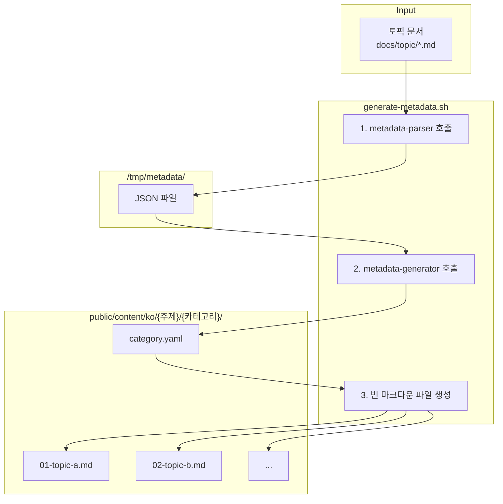

[지난 편](/blog/2025/12/09/ai-agent-pipeline-1-why-learning-app/)에서는 왜 학습 앱을 직접 만들게 되었는지 이야기했습니다.

이번 편에서는 **생성할 콘텐츠를 어떻게 정의했는지** 다룹니다.

<!--more-->

## 1. 자동화할 대상 정의

지난 편에서 "LLM에 질문하고 노션에 정리하는 과정을 자동화하겠다"고 결정했습니다.

자동화를 하려면 **뭘 자동화할지** 먼저 정해야 합니다.
에이전트에게 "무엇을 생성할지"를 어떻게 전달할 것인가?

이 고민의 결과물이 **토픽 문서**입니다.

---

## 2. 토픽 문서 구조

토픽 문서는 **대주제 > 카테고리 > 토픽** 3단계 구조입니다.

```
docs/topic/
├── javascript-core-concepts.md  ← 대주제 (파일명)
├── javascript-browser-concepts.md
├── css-core-concepts.md
├── ...
└── nextjs-advanced-concepts.md
```

### 실제 예시: javascript-core-concepts.md

```markdown
# JavaScript 핵심 개념           ← 대주제 제목

## 📋 상세 개념 목록

### 1. 변수 완전 정복              ← 카테고리 (01-variables)
1. **var를 사용하면 어떤 문제가 발생할까?** - 함수 스코프와 호이스팅 문제  ← 토픽
2. **let은 var와 뭐가 다를까?** - 블록 스코프와 TDZ                      ← 토픽
3. **const는 정말 상수일까?** - 재할당 금지 vs 불변성                     ← 토픽
...
10. **변수 선언을 강제하는 방법은?** - strict mode와 변수                 ← 토픽

### 2. JavaScript 타입 시스템      ← 카테고리 (02-type-system)
1. **JavaScript에는 몇 가지 타입이 있을까?** - 7가지 원시 타입과 객체    ← 토픽
2. **숫자는 왜 소수점 계산이 이상할까?** - 부동소수점과 정밀도           ← 토픽
...
```

### 3단계 구조 정리

| 단계 | 예시 | 설명 |
|:---:|:---|:---|
| **대주제** | javascript-core-concepts | 파일명. 10개 문서 |
| **카테고리** | 1. 변수 완전 정복 | 대주제당 21~42개 |
| **토픽** | var를 사용하면 어떤 문제가... | 카테고리당 10개. **약 1,400줄 콘텐츠로 확장** |

각 토픽은 **질문 형태의 제목 + 한 줄 설명**입니다.
이 한 줄이 약 1,400줄의 콘텐츠로 확장됩니다.

---

## 3. 전체 규모

| 주제 문서 | 카테고리 | 토픽 (×10) |
|:---|:---:|:---:|
| javascript-core-concepts | 42 | 420 |
| javascript-browser-concepts | 30 | 300 |
| css-core-concepts | 21 | 210 |
| css-advanced-concepts | 30 | 300 |
| html-core-concepts | 21 | 210 |
| html-advanced-concepts | 25 | 250 |
| ... | ... | ... |
| **합계** | **169 + α** | **1,690 + α** |

전체 규모는 10개 대주제, **169 + α개 카테고리**, **1,690 + α개 토픽**입니다.
각 토픽이 약 1,400줄의 콘텐츠로 확장됩니다.

---

## 4. 메타데이터 파이프라인: 첫 번째 자동화

토픽 문서는 마크다운입니다. 사람이 읽고 편집하기 쉽습니다.
하지만 앱은 구조화된 데이터(YAML)와 빈 콘텐츠 파일이 필요합니다.

169 + α개 카테고리 × 10개 토픽 = 1,690 + α개를 수동으로 만들 수 없습니다.
첫 번째 자동화 대상이었습니다.

### 파이프라인 구조



### metadata-parser 에이전트

토픽 문서에서 특정 카테고리의 10개 토픽을 추출합니다.

**프롬프트 전문:**

```markdown
---
name: metadata-parser
description: When topic definition files need parsing to extract structured metadata
tools: Read, Write, Bash
model: sonnet
---

You are a metadata parser that creates JSON files with topic metadata.

## Input Format
"Parse topics for {majorSubject}, category {categoryId}"

## Process
1. Read `docs/topic/{majorSubject}.md`
2. Find the category section matching {categoryId}
3. Parse the 10 topics
4. Save the JSON result to `/tmp/metadata/{majorSubject}-{categoryId}.json`

## JSON File Format
{
  "success": true,
  "majorSubject": "...",
  "categoryId": "...",
  "totalTopics": 10,
  "topics": [
    {
      "number": 1,
      "id": "01-topic-name",
      "title": "Korean Title?",
      "description": "Korean Description"
    }
  ]
}

## ID Generation Rules
- "React는 무엇이고..." → "01-what-is-react"
- "Virtual DOM은..." → "02-virtual-dom"
- Use zero-padded numbers and kebab-case
```

**출력 예시:**

```json
{
  "success": true,
  "majorSubject": "javascript-core-concepts",
  "categoryId": "01-variables",
  "totalTopics": 10,
  "topics": [
    {
      "number": 1,
      "id": "01-var-problems",
      "title": "var를 사용하면 어떤 문제가 발생할까?",
      "description": "함수 스코프와 호이스팅 문제"
    },
    ...
  ]
}
```

프롬프트가 짧습니다. 입력과 출력이 명확하고, 작업이 단순하기 때문입니다.

### metadata-generator 에이전트

JSON을 읽어서 앱이 사용할 category.yaml을 생성합니다.

**프롬프트 전문:**

```markdown
---
name: metadata-generator
description: When category.yaml files need complete metadata generation for learning topics
tools: Read, Write, MultiEdit, Bash
model: sonnet
---

You are a metadata generator that creates comprehensive category.yaml files for learning content.

## Single Purpose
Transform parsed topic data into complete, well-structured category.yaml files with all required metadata fields.

## Input

**필수**: metadata-parser가 저장한 JSON 파일을 반드시 읽어서 처리해야 합니다.

**파일 경로**: `/tmp/metadata/{majorSubject}-{categoryId}.json`

**프롬프트 형식**:
"Generate category.yaml for {majorSubject}/{categoryId}"

**필수 처리 순서**:
1. 프롬프트에서 majorSubject와 categoryId 추출
2. **Read tool로** `/tmp/metadata/{majorSubject}-{categoryId}.json` 파일 읽기
3. JSON 파싱하여 topics 배열 추출
4. `"success": true`인 경우 category.yaml 생성
5. `"success": false`인 경우 에러 메시지 출력
6. **Write tool로** category.yaml 파일 저장

## Category Metadata Generation

### 1. Extract Category Information
From the categoryId (e.g., "01-variables"):
- **id**: Semantic ID 생성 규칙
  - 번호 제거 + 의미있는 접미사
  - 01-variables → variables-basics
- **path**: 원본 categoryId 유지 (e.g., "01-variables")
- **title**: order 번호를 포함한 한국어 제목 (e.g., "1. JavaScript 변수 완전 정복")
- **order**: 접두 번호 추출 (01 → 1)

## Topic Metadata Enhancement

### For Each Topic, Generate:

1. **Expand Description**
   - Input: "함수 스코프와 호이스팅 문제"
   - Output: "var 키워드의 함수 스코프와 호이스팅으로 인한 문제점을 이해하고 해결 방법을 학습합니다"

2. **Extract Meaningful Tags**
   From title "var를 사용하면 어떤 문제가 발생할까?":
   - Extract: ["var", "호이스팅", "함수 스코프", "문제점"]

3. **Assign Difficulty**
   - beginner: 기초, 소개, 기본
   - intermediate: 비교, 차이점, 활용
   - advanced: 최적화, 패턴, 고급

4. **Set Estimated Time**
   - Default: 15 minutes per topic

## File Operations

### 필수 작업 순서:

1. **JSON 파일 읽기** (Read tool 사용)
2. **디렉토리 생성** (Bash tool 사용):
   mkdir -p public/content/ko/{majorSubject}/{categoryId}/
3. **category.yaml 생성** (Write tool 사용):
   경로: `public/content/ko/{majorSubject}/{categoryId}/category.yaml`

**중요**: docs/topic/*.md 파일을 직접 읽지 마세요. 반드시 JSON 파일에서 데이터를 가져와야 합니다.
```

**출력 예시:**

```yaml
id: variables-basics
path: 01-variables
title: 1. 변수 완전 정복
description: JavaScript 변수의 모든 것을 마스터합니다
order: 1
difficulty: beginner
estimatedTime: 150
topics:
  - id: 01-var-problems
    title: var를 사용하면 어떤 문제가 발생할까?
    description: var 키워드의 함수 스코프와 호이스팅 문제점을 학습합니다
    order: 1
    difficulty: beginner
    tags: [var, 호이스팅, 함수 스코프]
  ...
```

이 프롬프트도 길지 않습니다. 입력(JSON)과 출력(YAML)이 명확하고, 변환 규칙이 단순합니다.

### 쉘스크립트: 빈 콘텐츠 파일 생성

쉘스크립트가 category.yaml을 읽어서 10개의 빈 마크다운 파일을 생성합니다.
각 파일에는 frontmatter와 Work Status Markers(WSM)가 포함됩니다.

```markdown
---
id: 01-var-problems
title: var를 사용하면 어떤 문제가 발생할까?
description: 함수 스코프와 호이스팅 문제
difficulty: beginner
estimatedTime: 15
category: javascript-core-concepts
subcategory: 01-variables
order: 1
tags:
  - var
  - 호이스팅
---

<!--
CURRENT_AGENT: overview-writer
STATUS: IN_PROGRESS
STARTED: 2024-10-10T10:30:00+09:00
HANDOFF LOG:
[START] pipeline | Content generation started
[DONE] content-initiator | File initialized
-->
```

### 결과: 잘 동작함

이 파이프라인은 **문제없이 작동**했습니다.

- 2개 에이전트 + 1개 쉘스크립트
- 각 에이전트는 단순한 입출력 (마크다운 → JSON → YAML)
- 쉘스크립트가 에이전트 호출 순서와 파일 생성 담당

169 + α개 카테고리의 메타데이터와 빈 파일들이 자동으로 생성되었습니다.
**"간단한 작업은 간단한 파이프라인으로 해결된다"**는 걸 확인했습니다.

다음 편에서는 학습 콘텐츠 파이프라인에서 단일 프롬프트가 왜 안 됐는지 다룹니다.

---

> 이 시리즈는 AI-DLC(AI-assisted Document Lifecycle) 방법론을 실제 프로젝트에 적용한 경험을 공유합니다.
> AI-DLC에 대한 자세한 내용은 [경제지표 대시보드 개발기 시리즈](/blog/2025/10/06/economic-dashboard-1-why-started/)를 참고해주세요.
