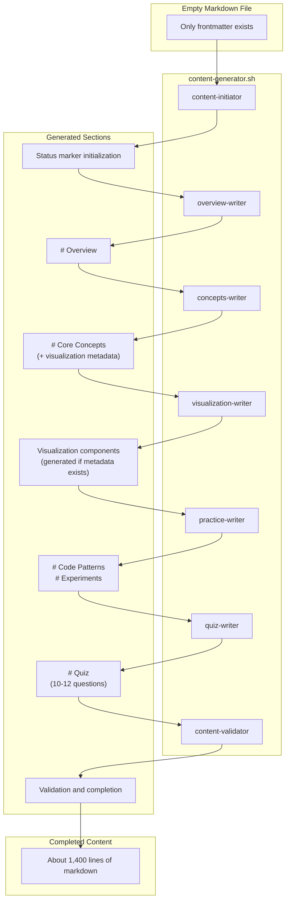

In the [previous article](/en/blog/2025/12/30/ai-agent-pipeline-5-prompt-evolution/), we covered the process of completing agent prompts. While discussing prompts, I talked about "failure" and "success"—those results were confirmed while running the pipeline.

This article summarizes the pipeline structure I configured.

<!--more-->

## 1. 7 Content Agent Configuration

Just as the metadata pipeline was configured in [article 2](/en/blog/2025/12/16/ai-agent-pipeline-2-what-to-generate/), content generation is also configured as a pipeline. The **content pipeline** takes the empty markdown files generated in article 2 as input and fills them with about 1,400 lines of learning content:

| # | Agent | Role |
|:---:|:---|:---|
| 1 | content-initiator | File initialization, status marker creation |
| 2 | overview-writer | Write Overview section |
| 3 | concepts-writer | Core Concepts section (3-level difficulty) |
| 4 | visualization-writer | Generate visualization components |
| 5 | practice-writer | Code Patterns + Experiments |
| 6 | quiz-writer | Quiz section (10-12 questions) |
| 7 | content-validator | Full validation |

Each agent handles **only one section**. When a single agent generated all 1,400 lines, quality would drop from the middle onward. Separating roles made prompts shorter, and each agent could focus only on its section. This process was covered in detail in [article 3](/en/blog/2025/12/23/ai-agent-pipeline-3-why-seven-agents/) and [article 4](/en/blog/2025/12/26/ai-agent-pipeline-4-why-still-failed/).

### Content Pipeline Structure



There's a reason concepts-writer and visualization-writer are separated. Initially, concepts-writer handled both core concept explanations and visualization. But with just the 3-level difficulty (Easy/Normal/Expert) explanations being substantial, adding visualization generation caused quality to drop. So I separated them so concepts-writer only defines visualization metadata, and actual visualization generation is handed off to visualization-writer.

visualization-writer is always called, but internally it checks if metadata exists and either generates or skips. The pipeline continues even without visualization.

What guarantees this order is **Work Status Markers (WSM)**.

---

## 2. Work Status Markers (WSM)

Let me summarize how Work Status Markers (hereafter WSM) are structured.

When multiple agents work on a single file in relay fashion, the biggest problem is not knowing "who worked when." Agent A might complete work, but Agent B might not know this and redo the same work, or skip it entirely.

WSM solves this problem. By recording current state in the file itself, any agent can read the file and immediately know "whose turn it is now" and "who worked before." Like passing a baton in a relay race, WSM acts as the baton between agents.

### WSM Basic Structure

The following markers are inserted at the top of each markdown file. Being HTML comments, they track state without affecting rendering:

```markdown
<!--
CURRENT_AGENT: concepts-writer
STATUS: IN_PROGRESS
STARTED: 2024-01-15T10:30:00+09:00
UPDATED: 2024-01-15T10:35:00+09:00
HANDOFF LOG:
[START] pipeline | Content generation started | 2024-01-15T10:30:00+09:00
[DONE] content-initiator | Initialized content structure | 2024-01-15T10:31:00+09:00
[DONE] overview-writer | Overview section completed | 2024-01-15T10:35:00+09:00
-->
```

### WSM Field Descriptions

| Field | Description |
|:---|:---|
| `CURRENT_AGENT` | Name of currently working agent |
| `STATUS` | PENDING / IN_PROGRESS / COMPLETED / FAILED |
| `STARTED` | Pipeline start time (ISO 8601) |
| `UPDATED` | Last update time (ISO 8601) |
| `HANDOFF LOG` | Agent work history (pipe-delimited) |

### How Agents Use WSM

1. **Before starting work**: Check WSM → Verify `CURRENT_AGENT` is self
2. **During work**: Maintain `STATUS: IN_PROGRESS`
3. **After completing work**:
   - Add `[DONE] agent | message | timestamp` to `HANDOFF LOG`
   - Change `CURRENT_AGENT` to next agent

---

## 3. Input/Output Contract

WSM alone isn't enough. You can know "whose turn it is now," but if "what to do" and "what state to hand off" aren't clear, each agent interprets differently. Even defining rules in prompts, formats weren't consistent.

While applying the AI-DLC methodology, existing rules were restructured into the **Contract pattern**. This approach is similar to the Design by Contract concept in software engineering. `input_contract` specifies exactly "what state the file must be in for this agent to execute," and `output_contract` specifies "what state the file must be in after work completion." Now each agent clearly knows what it receives and what it must hand off.

### Example: concepts-writer

```xml
<input_contract>
File State:
- Required: Target markdown file with frontmatter, WSM, Overview section
- CURRENT_AGENT: concepts-writer
- STATUS: IN_PROGRESS
- HANDOFF LOG: Contains [DONE] overview-writer | ...

Validation:
- Overview section must exist
- WSM must be in correct state
</input_contract>

<output_contract>
Section Structure:
- Add # Core Concepts section
- 3-5 concepts, each including Easy/Normal/Expert
- **ID** field required for each concept

State Changes:
- HANDOFF LOG: Add [DONE] concepts-writer | message | timestamp
- CURRENT_AGENT: Change to visualization-writer
</output_contract>
```

### Role of Contracts

| Item | input_contract | output_contract |
|:---|:---|:---|
| Purpose | Define pre-execution conditions | Define post-completion guarantees |
| Verification | Confirm previous agent's work | Guarantee next agent's input |

---

## 4. Handoff Protocol

Handoff is the process where one agent finishes work and passes the file to the next agent.

Typical agent frameworks (LangGraph, CrewAI, etc.) provide state management features. But since I implemented with only shell scripts and Claude CLI without a framework, I chose to record state in the file itself.

Claude Code CLI has usage limits, so pipeline execution can be interrupted mid-way. If state is recorded in the file, you can resume from the interrupted point when restarting.

### Actual Operation

The shell script calls agents in a predefined order:

```
content-initiator → overview-writer → concepts-writer
    → visualization-writer → practice-writer → quiz-writer
    → content-validator
```

When the pipeline runs normally, the shell follows this order to call agents sequentially. Each agent changes `CURRENT_AGENT` to the next agent after completing work and leaves a completion record in `HANDOFF_LOG`.

---

## 5. Actual Operation Example

Let me summarize how the WSM, Contract, and handoff protocol described above actually work with an example. This is the process of the `var-hoisting.md` file being completed through 7 agents.

### Step 1: content-initiator

```markdown
<!--
CURRENT_AGENT: overview-writer
STATUS: IN_PROGRESS
STARTED: 2024-01-15T10:30:00+09:00
UPDATED: 2024-01-15T10:31:00+09:00
HANDOFF LOG:
[START] pipeline | Content generation started | 2024-01-15T10:30:00+09:00
[DONE] content-initiator | Initialized content structure | 2024-01-15T10:31:00+09:00
-->

---
title: "What problems occur when using var?"
...
---
```

### Step 2: overview-writer

```markdown
<!--
CURRENT_AGENT: concepts-writer
STATUS: IN_PROGRESS
STARTED: 2024-01-15T10:30:00+09:00
UPDATED: 2024-01-15T10:35:00+09:00
HANDOFF LOG:
[START] pipeline | Content generation started | 2024-01-15T10:30:00+09:00
[DONE] content-initiator | Initialized content structure | 2024-01-15T10:31:00+09:00
[DONE] overview-writer | Overview section completed | 2024-01-15T10:35:00+09:00
-->

...

# Overview

The var keyword is a variable declaration method used since early JavaScript...
```

### Step 3: concepts-writer

```markdown
<!--
CURRENT_AGENT: visualization-writer
STATUS: IN_PROGRESS
STARTED: 2024-01-15T10:30:00+09:00
UPDATED: 2024-01-15T10:45:00+09:00
HANDOFF LOG:
[START] pipeline | Content generation started | 2024-01-15T10:30:00+09:00
[DONE] content-initiator | Initialized content structure | 2024-01-15T10:31:00+09:00
[DONE] overview-writer | Overview section completed | 2024-01-15T10:35:00+09:00
[DONE] concepts-writer | Core concepts section completed | 2024-01-15T10:45:00+09:00
-->

...

# Core Concepts

## Concept: Hoisting

**ID**: hoisting

### Easy
A phenomenon where variables magically rise to the top...

### Normal
Before code execution, the JavaScript engine moves variable declarations to the top of the scope...

### Expert
In the ECMAScript specification, Variable Hoisting is...
```

### Steps 4-7: Remaining Agents

Subsequent agents proceed in the same pattern:

- **visualization-writer**: Generates components if visualization metadata left by concepts-writer exists, skips otherwise
- **practice-writer**: Writes Code Patterns and Experiments sections
- **quiz-writer**: Generates 10-12 quiz questions
- **content-validator**: Validates entire content and adds `[COMPLETE]` marker

Each time an agent completes, a `[DONE]` record is added to `HANDOFF_LOG`, and `CURRENT_AGENT` changes to the next agent.

---

## 6. Conclusion

The key to this collaboration structure is **role separation** and **state recording**.

Each agent handles only its section. concepts-writer only writes the Core Concepts section and doesn't need to know how the Overview section was written. It only checks the condition defined in `input_contract` that "Overview section must exist." Thanks to this loose coupling, modifying a specific agent's prompt doesn't affect other agents.

What actually executes this collaboration structure is **shell scripts**. The next article will cover shell orchestration.

---

> This series shares experiences applying the AI-DLC (AI-assisted Document Lifecycle) methodology to an actual project.
> For more details about AI-DLC, please refer to the [Economic Dashboard Development Series](/en/blog/2025/10/06/economic-dashboard-1-why-started/).
