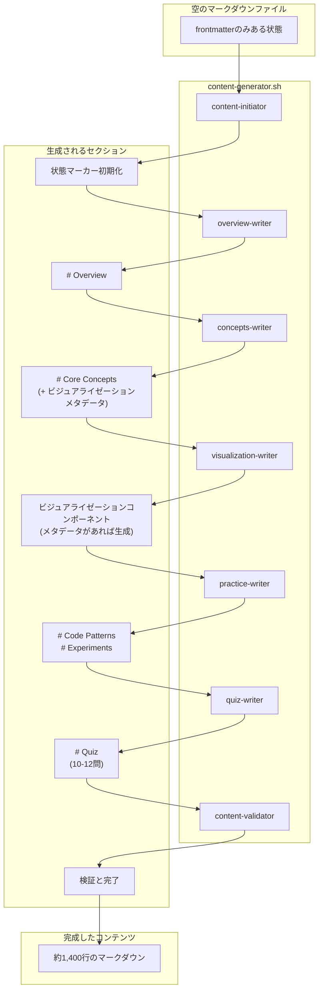

[前回の記事](/ja/blog/2025/12/30/ai-agent-pipeline-5-prompt-evolution/)では、エージェントプロンプトを完成させるまでの過程を扱いました。プロンプトを扱いながら「失敗」「成功」と話しましたが、その結果はパイプラインを実行しながら確認したものでした。

今回は、私が構成したパイプライン構造をまとめました。

<!--more-->

## 1. 7つのコンテンツエージェント構成

[2編](/ja/blog/2025/12/16/ai-agent-pipeline-2-what-to-generate/)でメタデータパイプラインが構成されたように、コンテンツ生成もパイプラインとして構成されています。2編で生成された空のマークダウンファイルを入力として受け取り、約1,400行の学習コンテンツで埋めるのが**コンテンツパイプライン**です：

| # | エージェント | 役割 |
|:---:|:---|:---|
| 1 | content-initiator | ファイル初期化、状態マーカー生成 |
| 2 | overview-writer | Overviewセクション作成 |
| 3 | concepts-writer | Core Conceptsセクション（3段階難易度） |
| 4 | visualization-writer | ビジュアライゼーションコンポーネント生成 |
| 5 | practice-writer | Code Patterns + Experiments |
| 6 | quiz-writer | Quizセクション（10-12問） |
| 7 | content-validator | 全体検証 |

各エージェントは**1つのセクションのみ**を担当します。1つのエージェントが1,400行全体を生成すると、中間から品質が低下する問題がありました。役割を分離するとプロンプトが短くなり、各エージェントが自分のセクションにのみ集中できました。この過程は[3編](/ja/blog/2025/12/23/ai-agent-pipeline-3-why-seven-agents/)と[4編](/ja/blog/2025/12/26/ai-agent-pipeline-4-why-still-failed/)で詳しく扱いました。

### コンテンツパイプライン構造



concepts-writerとvisualization-writerが分離された理由があります。最初はconcepts-writerが核心概念の説明とビジュアライゼーションの両方を担当していました。しかし、3段階の難易度（Easy/Normal/Expert）の説明だけでも分量が多いのに、ビジュアライゼーションまで生成するように言うと品質が低下しました。そこでconcepts-writerはビジュアライゼーションメタデータのみを定義し、実際のビジュアライゼーション生成はvisualization-writerに渡すように分離しました。

visualization-writerは常に呼び出されますが、内部でメタデータがあるかどうかを確認した後、生成またはスキップします。ビジュアライゼーションがなくてもパイプラインは継続します。

この順序を保証するのが**状態マーカー（Work Status Markers）**です。

---

## 2. 状態マーカー（Work Status Markers）

状態マーカー（以下WSM）がどのように構成されているかをまとめました。

複数のエージェントが1つのファイルをリレー方式で作業するとき、最大の問題は「誰がいつ作業したか」がわからないことです。エージェントAが作業を完了したのに、エージェントBがそれを知らずに同じ作業をやり直したり、完全にスキップしたりする可能性があります。

WSMはこの問題を解決します。ファイル自体に現在の状態を記録することで、どのエージェントでもファイルを読めば「今誰の番か」「以前誰が作業したか」を即座に知ることができます。リレー競走でバトンを渡すように、WSMがエージェント間のバトンの役割を果たします。

### WSM基本構造

各マークダウンファイルの上部に次のようなマーカーが挿入されます。HTMLコメント形式なので、レンダリングに影響を与えずに状態を追跡できます：

```markdown
<!--
CURRENT_AGENT: concepts-writer
STATUS: IN_PROGRESS
STARTED: 2024-01-15T10:30:00+09:00
UPDATED: 2024-01-15T10:35:00+09:00
HANDOFF LOG:
[START] pipeline | Content generation started | 2024-01-15T10:30:00+09:00
[DONE] content-initiator | Initialized content structure | 2024-01-15T10:31:00+09:00
[DONE] overview-writer | Overview section completed | 2024-01-15T10:35:00+09:00
-->
```

### WSMフィールド説明

| フィールド | 説明 |
|:---|:---|
| `CURRENT_AGENT` | 現在作業中のエージェント名 |
| `STATUS` | PENDING / IN_PROGRESS / COMPLETED / FAILED |
| `STARTED` | パイプライン開始時刻（ISO 8601） |
| `UPDATED` | 最終更新時刻（ISO 8601） |
| `HANDOFF LOG` | エージェント作業履歴（パイプ区切り） |

### エージェントがWSMを使用する方法

1. **作業開始前**：WSM確認 → `CURRENT_AGENT`が自分かどうか確認
2. **作業中**：`STATUS: IN_PROGRESS`維持
3. **作業完了後**：
   - `HANDOFF LOG`に`[DONE] agent | message | timestamp`を追加
   - `CURRENT_AGENT`を次のエージェントに変更

---

## 3. Input/Output Contract

WSMだけでは十分ではありません。「今誰の番か」はわかりますが、「何をすべきか」と「どの状態で渡すべきか」が明確でないと、エージェントごとに異なる解釈をします。プロンプトにルールを定義しても形式が一貫しない問題がありました。

AI-DLC方法論を適用しながら、既存のルールが**Contractパターン**に再構成されました。このアプローチはソフトウェア工学のDesign by Contract概念と似ています。`input_contract`には「このエージェントが実行されるためにファイルがどの状態でなければならないか」、`output_contract`には「作業完了後にファイルがどの状態になるべきか」が正確に明示されています。これで各エージェントは自分が何を受け取り、何を渡すべきかを明確に知ることができます。

### 例：concepts-writer

```xml
<input_contract>
File State:
- Required: Target markdown file with frontmatter, WSM, Overview section
- CURRENT_AGENT: concepts-writer
- STATUS: IN_PROGRESS
- HANDOFF LOG: [DONE] overview-writer | ... を含む

Validation:
- Overviewセクションが存在すること
- WSMが正しい状態であること
</input_contract>

<output_contract>
Section Structure:
- # Core Conceptsセクション追加
- 3-5個の概念、それぞれEasy/Normal/Expertを含む
- 各概念に**ID**フィールド必須

State Changes:
- HANDOFF LOG: [DONE] concepts-writer | message | timestampを追加
- CURRENT_AGENT: visualization-writerに変更
</output_contract>
```

### Contractの役割

| 項目 | input_contract | output_contract |
|:---|:---|:---|
| 目的 | 実行前条件を定義 | 完了後の保証を定義 |
| 検証 | 前のエージェントの作業を確認 | 次のエージェントの入力を保証 |

---

## 4. ハンドオフプロトコル

ハンドオフ（handoff）は、あるエージェントが作業を終えて次のエージェントにファイルを渡す過程です。

一般的なエージェントフレームワーク（LangGraph、CrewAIなど）は状態管理機能を提供しています。しかし私はフレームワークなしでシェルスクリプトとClaude CLIだけで実装したため、ファイル自体に状態を記録する方式を選びました。

Claude Code CLIには使用量制限があるため、パイプライン実行途中で中断される可能性があります。ファイルに状態が記録されていれば、再起動時に中断された地点から再開できます。

### 実際の動作方式

シェルスクリプトはあらかじめ定義された順序でエージェントを呼び出します：

```
content-initiator → overview-writer → concepts-writer
    → visualization-writer → practice-writer → quiz-writer
    → content-validator
```

パイプラインが正常に実行されるとき、シェルはこの順序に従ってエージェントを順次呼び出します。各エージェントは作業完了後に`CURRENT_AGENT`を次のエージェントに変更し、`HANDOFF_LOG`に完了記録を残します。

---

## 5. 実際の動作例

前述のWSM、Contract、ハンドオフプロトコルが実際にどのように動作するかを例でまとめました。`var-hoisting.md`ファイルが7つのエージェントを経て完成される過程です。

### Step 1: content-initiator

```markdown
<!--
CURRENT_AGENT: overview-writer
STATUS: IN_PROGRESS
STARTED: 2024-01-15T10:30:00+09:00
UPDATED: 2024-01-15T10:31:00+09:00
HANDOFF LOG:
[START] pipeline | Content generation started | 2024-01-15T10:30:00+09:00
[DONE] content-initiator | Initialized content structure | 2024-01-15T10:31:00+09:00
-->

---
title: "varを使うとどんな問題が発生するか？"
...
---
```

### Step 2: overview-writer

```markdown
<!--
CURRENT_AGENT: concepts-writer
STATUS: IN_PROGRESS
STARTED: 2024-01-15T10:30:00+09:00
UPDATED: 2024-01-15T10:35:00+09:00
HANDOFF LOG:
[START] pipeline | Content generation started | 2024-01-15T10:30:00+09:00
[DONE] content-initiator | Initialized content structure | 2024-01-15T10:31:00+09:00
[DONE] overview-writer | Overview section completed | 2024-01-15T10:35:00+09:00
-->

...

# Overview

varキーワードはJavaScript初期から使われている変数宣言方式です...
```

### Step 3: concepts-writer

```markdown
<!--
CURRENT_AGENT: visualization-writer
STATUS: IN_PROGRESS
STARTED: 2024-01-15T10:30:00+09:00
UPDATED: 2024-01-15T10:45:00+09:00
HANDOFF LOG:
[START] pipeline | Content generation started | 2024-01-15T10:30:00+09:00
[DONE] content-initiator | Initialized content structure | 2024-01-15T10:31:00+09:00
[DONE] overview-writer | Overview section completed | 2024-01-15T10:35:00+09:00
[DONE] concepts-writer | Core concepts section completed | 2024-01-15T10:45:00+09:00
-->

...

# Core Concepts

## Concept: Hoisting

**ID**: hoisting

### Easy
変数が魔法のように上に上がる現象...

### Normal
JavaScriptエンジンがコード実行前に変数宣言をスコープ上部に...

### Expert
ECMAScript仕様でVariable Hoistingは...
```

### Step 4-7: 残りのエージェント

以降のエージェントも同じパターンで進行します：

- **visualization-writer**：concepts-writerが残したビジュアライゼーションメタデータがあればコンポーネントを生成、なければスキップ
- **practice-writer**：Code PatternsとExperimentsセクションを作成
- **quiz-writer**：10-12個のクイズ問題を生成
- **content-validator**：全コンテンツを検証後`[COMPLETE]`マーカーを追加

各エージェントが完了するたびに`HANDOFF_LOG`に`[DONE]`記録が追加され、`CURRENT_AGENT`が次のエージェントに変更されます。

---

## 6. まとめ

この協業構造の核心は**役割分離**と**状態記録**です。

各エージェントは自分のセクションのみを担当します。concepts-writerはCore Conceptsセクションのみを作成し、Overviewセクションがどのように作成されたかを知る必要はありません。ただ`input_contract`に定義された「Overviewセクションが存在すること」という条件だけを確認します。このような疎結合のおかげで、特定のエージェントのプロンプトを修正しても他のエージェントに影響を与えません。

このような協業構造を実際に実行するのは**シェルスクリプト**です。次回はシェルオーケストレーションをまとめます。

---

> このシリーズはAI-DLC（AI-assisted Document Lifecycle）方法論を実際のプロジェクトに適用した経験を共有します。
> AI-DLCの詳細については、[経済指標ダッシュボード開発記シリーズ](/ja/blog/2025/10/06/economic-dashboard-1-why-started/)をご参照ください。
