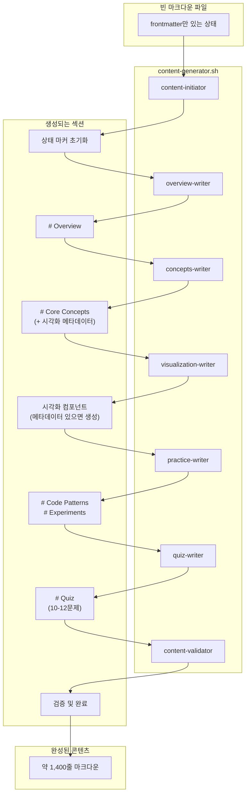

[지난 편](/blog/2025/12/30/ai-agent-pipeline-5-prompt-evolution/)에서는 에이전트 프롬프트를 완성하기까지의 과정을 다뤘습니다. 프롬프트를 다루면서 "실패", "성공"을 이야기했는데, 그 결과는 파이프라인을 실행하면서 확인한 것이었습니다.

이번 편에서는 제가 구성한 파이프라인 구조를 정리해봤습니다.

<!--more-->

## 1. 7개 콘텐츠 에이전트 구성

[2편](/blog/2025/12/16/ai-agent-pipeline-2-what-to-generate/)에서 메타데이터 파이프라인이 구성된 것처럼, 콘텐츠 생성도 파이프라인으로 구성되어 있습니다. 2편에서 생성된 빈 마크다운 파일을 입력받아 약 1,400줄의 학습 콘텐츠로 채우는 것이 **콘텐츠 파이프라인**입니다:

| # | 에이전트 | 역할 |
|:---:|:---|:---|
| 1 | content-initiator | 파일 초기화, 상태 마커 생성 |
| 2 | overview-writer | Overview 섹션 작성 |
| 3 | concepts-writer | Core Concepts 섹션 (3단계 난이도) |
| 4 | visualization-writer | 시각화 컴포넌트 생성 |
| 5 | practice-writer | Code Patterns + Experiments |
| 6 | quiz-writer | Quiz 섹션 (10-12문제) |
| 7 | content-validator | 전체 검증 |

각 에이전트는 **한 가지 섹션만** 담당합니다. 하나의 에이전트가 1,400줄 전체를 생성하면 중간부터 품질이 떨어지는 문제가 있었습니다. 역할을 분리하니 프롬프트가 짧아지고, 각 에이전트가 자신의 섹션에만 집중할 수 있었습니다. 이 과정은 [3편](/blog/2025/12/23/ai-agent-pipeline-3-why-seven-agents/)과 [4편](/blog/2025/12/26/ai-agent-pipeline-4-why-still-failed/)에서 자세히 다뤘습니다.

### 콘텐츠 파이프라인 구조



concepts-writer와 visualization-writer가 분리된 이유가 있습니다. 처음에는 concepts-writer가 핵심 개념 설명과 시각화를 모두 담당했습니다. 하지만 3단계 난이도(Easy/Normal/Expert) 설명만 해도 분량이 많은데, 시각화까지 생성하라고 하니 품질이 떨어졌습니다. 그래서 concepts-writer는 시각화 메타데이터만 정의하고, 실제 시각화 생성은 visualization-writer에게 넘기도록 분리했습니다.

visualization-writer는 항상 호출되지만, 내부에서 메타데이터가 있는지 확인한 후 생성하거나 스킵합니다. 시각화가 없어도 파이프라인은 계속 진행됩니다.

이 순서를 보장하는 것이 **상태 마커(Work Status Markers)**입니다.

---

## 2. 상태 마커 (Work Status Markers)

상태 마커(이하 WSM)가 어떻게 구성되어 있는지 정리해봤습니다.

여러 에이전트가 하나의 파일을 릴레이 방식으로 작업할 때 가장 큰 문제는 "누가 언제 작업했는지"를 알 수 없다는 점입니다. 에이전트 A가 작업을 완료했는데, 에이전트 B가 이를 모르고 같은 작업을 다시 하거나, 아예 건너뛰어 버릴 수 있습니다.

WSM은 이 문제를 해결합니다. 파일 자체에 현재 상태를 기록함으로써, 어떤 에이전트든 파일을 읽으면 "지금 누구 차례인지", "이전에 누가 작업했는지"를 즉시 알 수 있습니다. 마치 릴레이 경주에서 바통을 넘기는 것처럼, WSM이 에이전트 간의 바통 역할을 합니다.

### WSM 기본 구조

각 마크다운 파일 상단에 다음과 같은 마커가 삽입됩니다. HTML 주석 형태라서 렌더링에 영향을 주지 않으면서 상태를 추적할 수 있습니다:

```markdown
<!--
CURRENT_AGENT: concepts-writer
STATUS: IN_PROGRESS
STARTED: 2024-01-15T10:30:00+09:00
UPDATED: 2024-01-15T10:35:00+09:00
HANDOFF LOG:
[START] pipeline | Content generation started | 2024-01-15T10:30:00+09:00
[DONE] content-initiator | Initialized content structure | 2024-01-15T10:31:00+09:00
[DONE] overview-writer | Overview section completed | 2024-01-15T10:35:00+09:00
-->
```

### WSM 필드 설명

| 필드 | 설명 |
|:---|:---|
| `CURRENT_AGENT` | 현재 작업 중인 에이전트 이름 |
| `STATUS` | PENDING / IN_PROGRESS / COMPLETED / FAILED |
| `STARTED` | 파이프라인 시작 시각 (ISO 8601) |
| `UPDATED` | 마지막 업데이트 시각 (ISO 8601) |
| `HANDOFF LOG` | 에이전트 작업 히스토리 (파이프 구분) |

### 에이전트가 WSM을 사용하는 방법

1. **작업 시작 전**: WSM 확인 → `CURRENT_AGENT`가 자신인지 확인
2. **작업 중**: `STATUS: IN_PROGRESS` 유지
3. **작업 완료 후**:
   - `HANDOFF LOG`에 `[DONE] agent | message | timestamp` 추가
   - `CURRENT_AGENT`를 다음 에이전트로 변경

---

## 3. Input/Output Contract

WSM만으로는 충분하지 않습니다. "지금 누구 차례인지"는 알 수 있지만, "무엇을 해야 하는지"와 "어떤 상태로 넘겨야 하는지"가 명확하지 않으면 에이전트마다 다르게 해석합니다. 프롬프트에 규칙을 정의해도 형식이 일관되지 않는 문제가 있었습니다.

AI-DLC 방법론을 적용하면서 기존 규칙들이 **Contract 패턴**으로 재구성되었습니다. 이 방식은 소프트웨어 공학의 Design by Contract 개념과 유사합니다. `input_contract`에는 "이 에이전트가 실행되려면 파일이 어떤 상태여야 하는지", `output_contract`에는 "작업 완료 후 파일이 어떤 상태가 되어야 하는지"가 정확히 명시되어 있습니다. 이제 각 에이전트는 자신이 무엇을 받고 무엇을 넘겨야 하는지 명확히 알게 됩니다.

### 예시: concepts-writer

```xml
<input_contract>
File State:
- Required: Target markdown file with frontmatter, WSM, Overview section
- CURRENT_AGENT: concepts-writer
- STATUS: IN_PROGRESS
- HANDOFF LOG: [DONE] overview-writer | ... 포함

Validation:
- Overview 섹션이 존재해야 함
- WSM이 올바른 상태여야 함
</input_contract>

<output_contract>
Section Structure:
- # Core Concepts 섹션 추가
- 3-5개 개념, 각각 Easy/Normal/Expert 포함
- 각 개념에 **ID** 필드 필수

State Changes:
- HANDOFF LOG: [DONE] concepts-writer | message | timestamp 추가
- CURRENT_AGENT: visualization-writer로 변경
</output_contract>
```

### Contract의 역할

| 항목 | input_contract | output_contract |
|:---|:---|:---|
| 목적 | 실행 전 조건 정의 | 완료 후 보장 정의 |
| 검증 | 이전 에이전트 작업 확인 | 다음 에이전트 입력 보장 |

---

## 4. 핸드오프 프로토콜

핸드오프(handoff)는 한 에이전트가 작업을 마치고 다음 에이전트에게 파일을 넘기는 과정입니다.

일반적인 에이전트 프레임워크(LangGraph, CrewAI 등)에서는 상태 관리 기능을 제공합니다. 하지만 저는 프레임워크 없이 쉘 스크립트와 Claude CLI만으로 구현했기 때문에, 파일 자체에 상태를 기록하는 방식을 선택했습니다.

Claude Code CLI는 사용량 제한이 있어서 파이프라인 실행 중간에 중단될 수 있습니다. 파일에 상태가 기록되어 있으면 재시작 시 중단된 지점부터 재개할 수 있습니다.

### 실제 동작 방식

쉘 스크립트는 미리 정의된 순서대로 에이전트를 호출합니다:

```
content-initiator → overview-writer → concepts-writer
    → visualization-writer → practice-writer → quiz-writer
    → content-validator
```

파이프라인이 정상 실행될 때는 쉘이 이 순서를 따라 에이전트를 순차적으로 호출합니다. 각 에이전트는 작업 완료 후 `CURRENT_AGENT`를 다음 에이전트로 변경하고 `HANDOFF_LOG`에 완료 기록을 남깁니다.

---

## 5. 실제 동작 예시

앞에서 설명한 WSM, Contract, 핸드오프 프로토콜이 실제로 어떻게 동작하는지 예시로 정리해봤습니다. `var-hoisting.md` 파일이 7개 에이전트를 거치면서 완성되는 과정입니다.

### Step 1: content-initiator

```markdown
<!--
CURRENT_AGENT: overview-writer
STATUS: IN_PROGRESS
STARTED: 2024-01-15T10:30:00+09:00
UPDATED: 2024-01-15T10:31:00+09:00
HANDOFF LOG:
[START] pipeline | Content generation started | 2024-01-15T10:30:00+09:00
[DONE] content-initiator | Initialized content structure | 2024-01-15T10:31:00+09:00
-->

---
title: "var를 사용하면 어떤 문제가 발생할까?"
...
---
```

### Step 2: overview-writer

```markdown
<!--
CURRENT_AGENT: concepts-writer
STATUS: IN_PROGRESS
STARTED: 2024-01-15T10:30:00+09:00
UPDATED: 2024-01-15T10:35:00+09:00
HANDOFF LOG:
[START] pipeline | Content generation started | 2024-01-15T10:30:00+09:00
[DONE] content-initiator | Initialized content structure | 2024-01-15T10:31:00+09:00
[DONE] overview-writer | Overview section completed | 2024-01-15T10:35:00+09:00
-->

...

# Overview

var 키워드는 JavaScript 초기부터 사용된 변수 선언 방식입니다...
```

### Step 3: concepts-writer

```markdown
<!--
CURRENT_AGENT: visualization-writer
STATUS: IN_PROGRESS
STARTED: 2024-01-15T10:30:00+09:00
UPDATED: 2024-01-15T10:45:00+09:00
HANDOFF LOG:
[START] pipeline | Content generation started | 2024-01-15T10:30:00+09:00
[DONE] content-initiator | Initialized content structure | 2024-01-15T10:31:00+09:00
[DONE] overview-writer | Overview section completed | 2024-01-15T10:35:00+09:00
[DONE] concepts-writer | Core concepts section completed | 2024-01-15T10:45:00+09:00
-->

...

# Core Concepts

## Concept: Hoisting

**ID**: hoisting

### Easy
변수가 마법처럼 위로 올라가는 현상...

### Normal
JavaScript 엔진이 코드 실행 전 변수 선언을 스코프 상단으로...

### Expert
ECMAScript 명세에서 Variable Hoisting은...
```

### Step 4-7: 나머지 에이전트들

이후 에이전트들도 동일한 패턴으로 진행됩니다:

- **visualization-writer**: concepts-writer가 남긴 시각화 메타데이터가 있으면 컴포넌트를 생성하고, 없으면 스킵
- **practice-writer**: Code Patterns와 Experiments 섹션 작성
- **quiz-writer**: 10-12개의 퀴즈 문제 생성
- **content-validator**: 전체 콘텐츠 검증 후 `[COMPLETE]` 마커 추가

각 에이전트가 완료될 때마다 `HANDOFF_LOG`에 `[DONE]` 기록이 추가되고, `CURRENT_AGENT`가 다음 에이전트로 변경됩니다.

---

## 6. 마무리

이 협업 구조의 핵심은 **역할 분리**와 **상태 기록**입니다.

각 에이전트는 자신의 섹션만 담당합니다. concepts-writer는 Core Concepts 섹션만 작성하고, Overview 섹션이 어떻게 작성되었는지는 알 필요가 없습니다. 다만 `input_contract`에 정의된 "Overview 섹션이 존재해야 한다"는 조건만 확인합니다. 이런 느슨한 결합 덕분에 특정 에이전트의 프롬프트를 수정해도 다른 에이전트에 영향을 주지 않습니다.

이러한 협업 구조를 실제로 실행하는 것은 **쉘 스크립트**입니다. 다음 편에서는 쉘 오케스트레이션을 정리합니다.

---

> 이 시리즈는 AI-DLC(AI-assisted Document Lifecycle) 방법론을 실제 프로젝트에 적용한 경험을 공유합니다.
> AI-DLC에 대한 자세한 내용은 [경제지표 대시보드 개발기 시리즈](/blog/2025/10/06/economic-dashboard-1-why-started/)를 참고해주세요.
