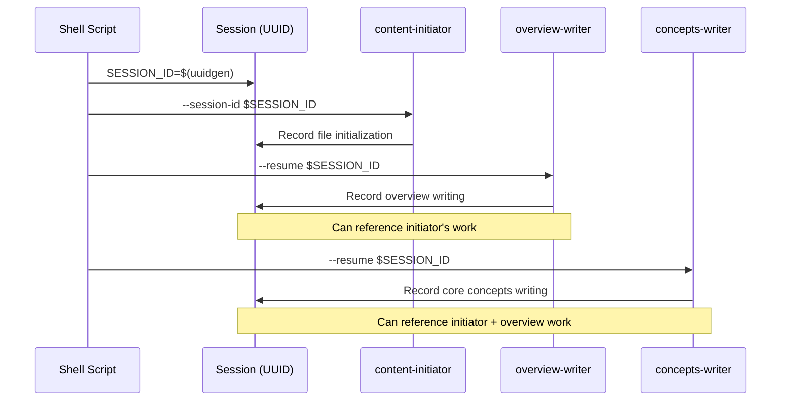
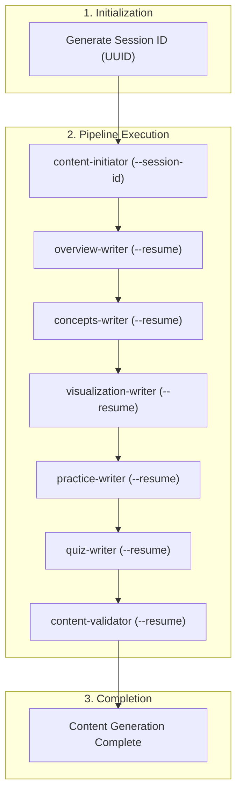

In the [previous article](/en/blog/2026/01/02/ai-agent-pipeline-6-seven-agents-collaboration/), we covered the collaboration structure of 7 agents and the handoff protocol.

This article summarizes the **shell script orchestration** I configured to run the 7 agents in the content generation pipeline.

<!--more-->

## 1. Why Shell Scripts

I was subscribed to the Claude Max Plan, but I wasn't using all my available tokens each week. So I wanted to do something with the remaining tokens.

When I started this work in August 2025, I didn't know about agent frameworks. I could pass prompts with the Claude Code CLI, and shell scripts were a natural choice for automating repetitive tasks.

Later I learned about agent frameworks like LangGraph and CrewAI, but these use API calls and require separate billing. To utilize the Max Plan subscription, I needed CLI-based approach, so I continued using shell scripts.

---

## 2. CLI Calling Method

Looking at the Claude Code CLI documentation, it had all the options needed for automation. I could pass prompts with the `-p` option and manage sessions with `--session-id` and `--resume`.

```bash
# First agent: Create new session
"$CLAUDE_PATH" -p "$prompt" \
    --session-id "$session_id" \
    --permission-mode bypassPermissions

# Subsequent agents: Resume existing session
"$CLAUDE_PATH" -p "$prompt" \
    --resume "$session_id" \
    --permission-mode bypassPermissions
```

| Option | Description |
|:---|:---|
| `-p` | Pass prompt |
| `--session-id` | Specify new session ID (first agent) |
| `--resume` | Resume existing session (subsequent agents) |
| `--permission-mode bypassPermissions` | Auto-execute without user confirmation |

`--permission-mode bypassPermissions` is an option that skips user confirmation for file modifications or command execution. It was essential for automation. However, it should only be used with trusted prompts.

---

## 3. Session Management

Why share sessions? If each agent runs independently, it can't know what the previous agent did. By sharing sessions, previous work can be referenced through conversation history.

Sessions are created per file (topic). While completing one topic, 7 agents share the same session.

```bash
# Generate session ID
SESSION_ID=$(uuidgen | tr '[:upper:]' '[:lower:]')
```



When sessions are shared, the next agent can see how the previous agent modified the file in the conversation history. For example, concepts-writer can reference the overview written by overview-writer to explain core concepts.

---

## 4. Sequential Execution Structure

Now that we know how to create sessions and call the CLI, we need to execute agents sequentially. Agents are executed in the order defined in the AGENT_ORDER array.

```bash
AGENT_ORDER=(
    "content-initiator"
    "overview-writer"
    "concepts-writer"
    "visualization-writer"
    "practice-writer"
    "quiz-writer"
    "content-validator"
)
```

The key is the `is_first` flag. A new session is created only on the first agent execution, and subsequent agents resume the session.

```bash
local is_first="true"
for ((i=start_index; i<${#AGENT_ORDER[@]}; i++)); do
    local current_agent="${AGENT_ORDER[$i]}"
    execute_agent_with_validation "$current_agent" "$file_path" "$SESSION_ID" "$is_first"
    is_first="false"
done
```

When each agent executes, the `generate_agent_prompt()` function generates the appropriate prompt for that agent:

```bash
case "$agent_name" in
    "content-initiator")
        prompt="Use the content-initiator subagent to initialize Work Status Markers for $topic_name topic. File path: $target_file"
        ;;
    "overview-writer")
        prompt="Use the overview-writer subagent to write Overview section for $topic_name topic. File path: $target_file"
        ;;
    "concepts-writer")
        prompt="Use the concepts-writer subagent to write Core Concepts section for $topic_name topic. File path: $target_file"
        ;;
    # ... remaining agents
esac
```

| Agent | Call Prompt |
|:---|:---|
| content-initiator | Use the content-initiator subagent to initialize Work Status Markers for $topic_name topic. File path: $target_file |
| overview-writer | Use the overview-writer subagent to write Overview section for $topic_name topic. File path: $target_file |
| concepts-writer | Use the concepts-writer subagent to write Core Concepts section for $topic_name topic. File path: $target_file |
| visualization-writer | Use the visualization-writer subagent to generate visualization component for $topic_name topic. File path: $target_file |
| practice-writer | Use the practice-writer subagent to write Code Patterns and Experiments sections for $topic_name topic. File path: $target_file |
| quiz-writer | Use the quiz-writer subagent to write Quiz section for $topic_name topic. File path: $target_file |
| content-validator | Use the content-validator subagent to validate content quality. File path: $target_file |

The shell script only instructs which subagent to run. The detailed prompts defining each agent's role and work method are stored in `.claude/agents/*.md` files, and Claude Code loads them automatically.

---

## 5. Conclusion

This article summarized how I orchestrated 7 agents with shell scripts:

- **CLI calling**: Pass subagent call commands with `-p`, manage sessions with `--session-id`/`--resume`
- **Session sharing**: 7 agents share the same session to reference previous work
- **Sequential execution**: Control order with AGENT_ORDER array and `is_first` flag

Based on this, the overall flow is as follows:



This is the normal execution flow of the pipeline. But it can fail midway. The next article will cover the rollback mechanism on failure.

---

> This series shares experiences applying the AI-DLC (AI-Driven Development Lifecycle) methodology to an actual project.
> For more details about AI-DLC, please refer to the [Economic Dashboard Development Series](/en/blog/2025/10/06/economic-dashboard-1-why-started/).
