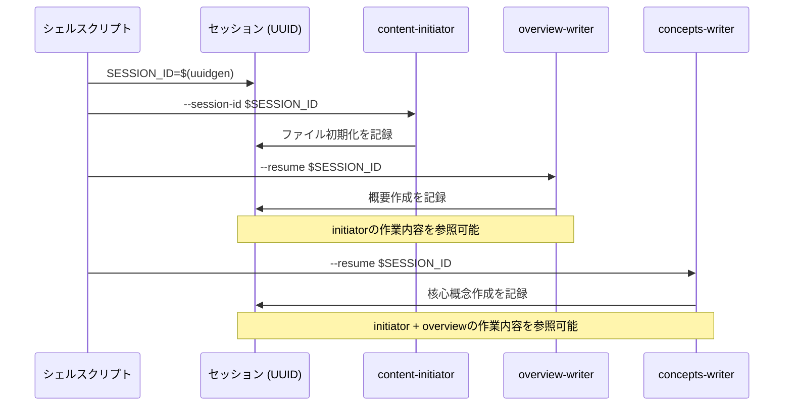
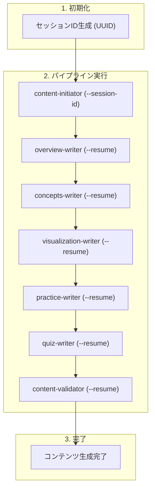

[前回の記事](/ja/blog/2026/01/02/ai-agent-pipeline-6-seven-agents-collaboration/)では、7つのエージェントの協業構造とハンドオフプロトコルを扱いました。

今回は、コンテンツ生成パイプラインの7つのエージェントを実行するために私が構成した**シェルスクリプトオーケストレーション**をまとめました。

<!--more-->

## 1. なぜシェルスクリプトか

Claude Max Planを購読していましたが、毎週使用可能なトークンを使い切れていませんでした。そこで余ったトークンで何かしたいと思いました。

この作業を始めた2025年8月には、エージェントフレームワークについて知りませんでした。Claude Code CLIでプロンプトを渡すことができ、繰り返し作業を自動化するならシェルスクリプトが自然な選択でした。

後でLangGraphやCrewAIのようなエージェントフレームワークを知りましたが、これらはAPI呼び出し方式で別途課金が必要でした。Max Planの購読を活用するにはCLIベースでなければならなかったので、シェルスクリプトを使い続けました。

---

## 2. CLI呼び出し方法

Claude Code CLIのドキュメントを見ると、自動化に必要なオプションが揃っていました。`-p`オプションでプロンプトを渡し、`--session-id`と`--resume`でセッションを管理できました。

```bash
# 最初のエージェント：新しいセッション作成
"$CLAUDE_PATH" -p "$prompt" \
    --session-id "$session_id" \
    --permission-mode bypassPermissions

# 以降のエージェント：既存セッション再開
"$CLAUDE_PATH" -p "$prompt" \
    --resume "$session_id" \
    --permission-mode bypassPermissions
```

| オプション | 説明 |
|:---|:---|
| `-p` | プロンプトを渡す |
| `--session-id` | 新しいセッションIDを指定（最初のエージェント） |
| `--resume` | 既存セッションを再開（以降のエージェント） |
| `--permission-mode bypassPermissions` | ユーザー確認なしで自動実行 |

`--permission-mode bypassPermissions`はファイル修正やコマンド実行時にユーザー確認をスキップするオプションです。自動化には必須でした。ただし、信頼できるプロンプトでのみ使用すべきです。

---

## 3. セッション管理

なぜセッションを共有する必要があるのでしょうか？各エージェントが独立して実行されると、前のエージェントが何をしたかわかりません。セッションを共有すると、会話履歴を通じて以前の作業を参照できます。

セッションはファイル（トピック）単位で作成されます。1つのトピックを完成させる間、7つのエージェントが同じセッションを共有します。

```bash
# セッションID生成
SESSION_ID=$(uuidgen | tr '[:upper:]' '[:lower:]')
```



セッションを共有すると、前のエージェントがファイルをどのように修正したかを次のエージェントが会話履歴で見ることができます。例えばconcepts-writerはoverview-writerが作成した概要を参考にして核心概念を説明できます。

---

## 4. 順次実行構造

セッション作成方法とCLI呼び出し方法がわかったので、エージェントを順次実行する必要があります。AGENT_ORDER配列に定義された順序でエージェントが実行されます。

```bash
AGENT_ORDER=(
    "content-initiator"
    "overview-writer"
    "concepts-writer"
    "visualization-writer"
    "practice-writer"
    "quiz-writer"
    "content-validator"
)
```

核心は`is_first`フラグです。最初のエージェント実行時にのみ新しいセッションが作成され、以降のエージェントはセッションを再開します。

```bash
local is_first="true"
for ((i=start_index; i<${#AGENT_ORDER[@]}; i++)); do
    local current_agent="${AGENT_ORDER[$i]}"
    execute_agent_with_validation "$current_agent" "$file_path" "$SESSION_ID" "$is_first"
    is_first="false"
done
```

各エージェントが実行されるとき、`generate_agent_prompt()`関数がそのエージェントに合ったプロンプトを生成します：

```bash
case "$agent_name" in
    "content-initiator")
        prompt="Use the content-initiator subagent to initialize Work Status Markers for $topic_name topic. File path: $target_file"
        ;;
    "overview-writer")
        prompt="Use the overview-writer subagent to write Overview section for $topic_name topic. File path: $target_file"
        ;;
    "concepts-writer")
        prompt="Use the concepts-writer subagent to write Core Concepts section for $topic_name topic. File path: $target_file"
        ;;
    # ... 残りのエージェント
esac
```

| エージェント | 呼び出しプロンプト |
|:---|:---|
| content-initiator | Use the content-initiator subagent to initialize Work Status Markers for $topic_name topic. File path: $target_file |
| overview-writer | Use the overview-writer subagent to write Overview section for $topic_name topic. File path: $target_file |
| concepts-writer | Use the concepts-writer subagent to write Core Concepts section for $topic_name topic. File path: $target_file |
| visualization-writer | Use the visualization-writer subagent to generate visualization component for $topic_name topic. File path: $target_file |
| practice-writer | Use the practice-writer subagent to write Code Patterns and Experiments sections for $topic_name topic. File path: $target_file |
| quiz-writer | Use the quiz-writer subagent to write Quiz section for $topic_name topic. File path: $target_file |
| content-validator | Use the content-validator subagent to validate content quality. File path: $target_file |

シェルスクリプトはどのsubagentを実行するかだけを指示します。各エージェントの役割と作業方式を定義した詳細なプロンプトは`.claude/agents/*.md`ファイルに保存されており、Claude Codeが自動的にロードします。

---

## 5. まとめ

今回は、7つのエージェントをシェルスクリプトでオーケストレーションした方式をまとめました：

- **CLI呼び出し**：`-p`でsubagent呼び出しコマンドを渡し、`--session-id`/`--resume`でセッション管理
- **セッション共有**：7つのエージェントが同じセッションを共有して以前の作業を参照
- **順次実行**：AGENT_ORDER配列と`is_first`フラグで順序制御

これを基に全体の流れをまとめると次のようになります。



これがパイプラインの正常実行フローです。しかし途中で失敗することもあります。次回は失敗時のロールバックメカニズムをまとめます。

---

> このシリーズはAI-DLC（AI-Driven Development Lifecycle）方法論を実際のプロジェクトに適用した経験を共有します。
> AI-DLCの詳細については、[経済指標ダッシュボード開発記シリーズ](/ja/blog/2025/10/06/economic-dashboard-1-why-started/)をご参照ください。
