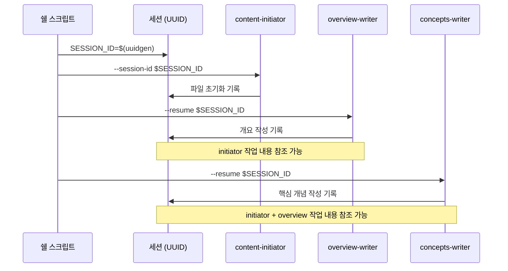
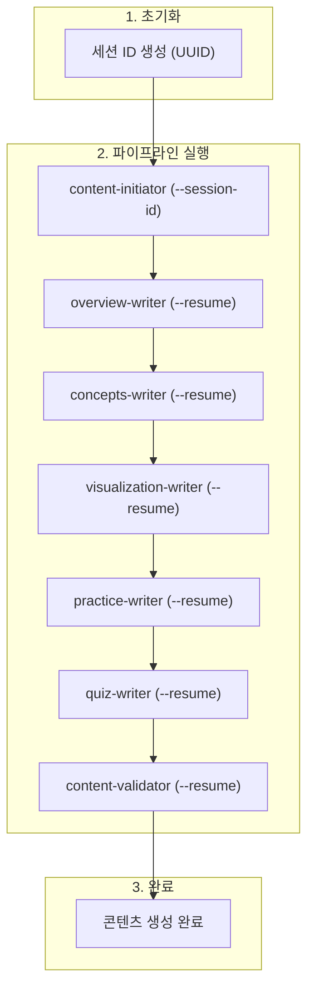

[지난 편](/blog/2026/01/02/ai-agent-pipeline-6-seven-agents-collaboration/)에서는 7개 에이전트의 협업 구조와 핸드오프 프로토콜을 다뤘습니다.

이번 편에서는 콘텐츠 생성 파이프라인의 7개 에이전트를 실행하기 위해 제가 구성한 **쉘 스크립트 오케스트레이션**을 정리해봤습니다.

<!--more-->

## 1. 왜 쉘 스크립트인가

Claude Max Plan을 구독하고 있었는데, 매주 사용 가능한 토큰을 다 소진하지 못하고 있었습니다. 그래서 남는 토큰으로 뭔가 해보고 싶었습니다.

이 작업을 시작한 2025년 8월에는 에이전트 프레임워크에 대해 알지 못했습니다. Claude Code CLI로 프롬프트를 전달할 수 있었고, 반복 작업을 자동화하려면 쉘 스크립트가 자연스러운 선택이었습니다.

나중에 LangGraph나 CrewAI 같은 에이전트 프레임워크들을 알게 됐지만, 이들은 API 호출 방식이라 별도 과금이 필요했습니다. Max Plan 구독을 활용하려면 CLI 기반이어야 했기 때문에 쉘 스크립트를 계속 사용했습니다.

---

## 2. CLI 호출 방법

Claude Code CLI 문서를 보니 자동화에 필요한 옵션들이 잘 갖춰져 있었습니다. `-p` 옵션으로 프롬프트를 전달하고, `--session-id`와 `--resume`으로 세션을 관리할 수 있었습니다.

```bash
# 첫 번째 에이전트: 새 세션 생성
"$CLAUDE_PATH" -p "$prompt" \
    --session-id "$session_id" \
    --permission-mode bypassPermissions

# 이후 에이전트: 기존 세션 재개
"$CLAUDE_PATH" -p "$prompt" \
    --resume "$session_id" \
    --permission-mode bypassPermissions
```

| 옵션 | 설명 |
|:---|:---|
| `-p` | 프롬프트 전달 |
| `--session-id` | 새 세션 ID 지정 (첫 번째 에이전트) |
| `--resume` | 기존 세션 재개 (이후 에이전트) |
| `--permission-mode bypassPermissions` | 사용자 확인 없이 자동 실행 |

`--permission-mode bypassPermissions`는 파일 수정이나 명령어 실행 시 사용자 확인을 건너뛰는 옵션입니다. 자동화를 위해 필수였습니다. 다만 신뢰할 수 있는 프롬프트에서만 사용해야 합니다.

---

## 3. 세션 관리

왜 세션을 공유해야 할까요? 각 에이전트가 독립적으로 실행되면 이전 에이전트가 무엇을 했는지 알 수 없습니다. 세션을 공유하면 대화 히스토리를 통해 이전 작업을 참조할 수 있습니다.

세션은 파일(토픽) 단위로 생성됩니다. 하나의 토픽을 완성하는 동안 7개 에이전트가 같은 세션을 공유합니다.

```bash
# 세션 ID 생성
SESSION_ID=$(uuidgen | tr '[:upper:]' '[:lower:]')
```



세션을 공유하면 이전 에이전트가 파일을 어떻게 수정했는지 다음 에이전트가 대화 히스토리에서 볼 수 있습니다. 예를 들어 concepts-writer는 overview-writer가 작성한 개요를 참고해서 핵심 개념을 설명할 수 있습니다.

---

## 4. 순차 실행 구조

세션 생성 방법과 CLI 호출 방법을 알았으니, 이제 에이전트들을 순차적으로 실행해야 합니다. AGENT_ORDER 배열에 정의된 순서대로 에이전트가 실행됩니다.

```bash
AGENT_ORDER=(
    "content-initiator"
    "overview-writer"
    "concepts-writer"
    "visualization-writer"
    "practice-writer"
    "quiz-writer"
    "content-validator"
)
```

핵심은 `is_first` 플래그입니다. 첫 번째 에이전트 실행 시에만 새 세션이 생성되고, 이후 에이전트는 세션을 재개합니다.

```bash
local is_first="true"
for ((i=start_index; i<${#AGENT_ORDER[@]}; i++)); do
    local current_agent="${AGENT_ORDER[$i]}"
    execute_agent_with_validation "$current_agent" "$file_path" "$SESSION_ID" "$is_first"
    is_first="false"
done
```

각 에이전트가 실행될 때 `generate_agent_prompt()` 함수가 해당 에이전트에 맞는 프롬프트를 생성합니다:

```bash
case "$agent_name" in
    "content-initiator")
        prompt="Use the content-initiator subagent to initialize Work Status Markers for $topic_name topic. File path: $target_file"
        ;;
    "overview-writer")
        prompt="Use the overview-writer subagent to write Overview section for $topic_name topic. File path: $target_file"
        ;;
    "concepts-writer")
        prompt="Use the concepts-writer subagent to write Core Concepts section for $topic_name topic. File path: $target_file"
        ;;
    # ... 나머지 에이전트들
esac
```

| 에이전트 | 호출 프롬프트 |
|:---|:---|
| content-initiator | Use the content-initiator subagent to initialize Work Status Markers for $topic_name topic. File path: $target_file |
| overview-writer | Use the overview-writer subagent to write Overview section for $topic_name topic. File path: $target_file |
| concepts-writer | Use the concepts-writer subagent to write Core Concepts section for $topic_name topic. File path: $target_file |
| visualization-writer | Use the visualization-writer subagent to generate visualization component for $topic_name topic. File path: $target_file |
| practice-writer | Use the practice-writer subagent to write Code Patterns and Experiments sections for $topic_name topic. File path: $target_file |
| quiz-writer | Use the quiz-writer subagent to write Quiz section for $topic_name topic. File path: $target_file |
| content-validator | Use the content-validator subagent to validate content quality. File path: $target_file |

쉘 스크립트는 어떤 subagent를 실행할지만 지시합니다. 각 에이전트의 역할과 작업 방식을 정의한 상세한 프롬프트는 `.claude/agents/*.md` 파일에 저장되어 있고, Claude Code가 자동으로 로드합니다.

---

## 5. 마무리

이번 편에서는 제가 7개 에이전트를 쉘 스크립트로 오케스트레이션한 방식을 정리해봤습니다:

- **CLI 호출**: `-p`로 subagent 호출 명령 전달, `--session-id`/`--resume`으로 세션 관리
- **세션 공유**: 7개 에이전트가 같은 세션을 공유해서 이전 작업 참조
- **순차 실행**: AGENT_ORDER 배열과 `is_first` 플래그로 순서 제어

이를 바탕으로 전체 흐름을 정리하면 다음과 같습니다.



이것이 파이프라인의 정상 실행 흐름입니다. 하지만 중간에 실패할 수도 있습니다. 다음 편에서는 실패 시 롤백 메커니즘을 정리합니다.

---

> 이 시리즈는 AI-DLC(AI-Driven Development Lifecycle) 방법론을 실제 프로젝트에 적용한 경험을 공유합니다.
> AI-DLC에 대한 자세한 내용은 [경제지표 대시보드 개발기 시리즈](/blog/2025/10/06/economic-dashboard-1-why-started/)를 참고해주세요.
