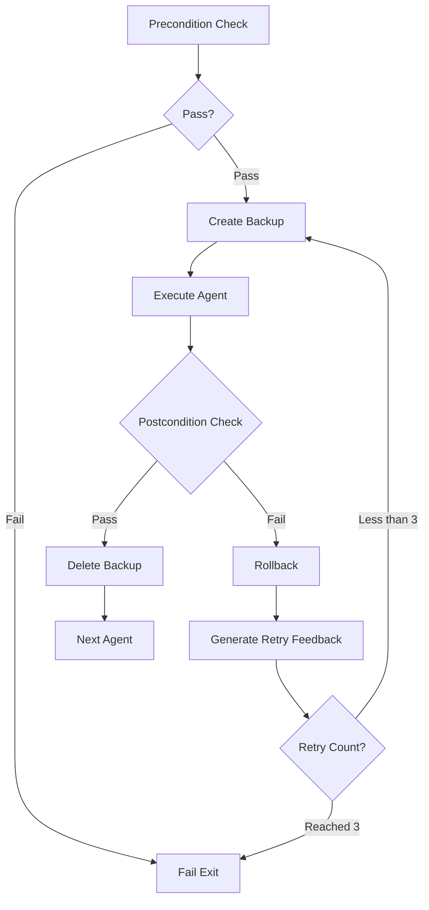

In the [previous article](/en/blog/2026/01/06/ai-agent-pipeline-7-shell-orchestration/), we covered the normal execution flow of the pipeline.

This article summarizes **how I handled failures**.

<!--more-->

## 1. Limitations of Initial Approach

This was the initial approach mentioned in [article 4](/en/blog/2025/12/22/ai-agent-pipeline-4-content-validator/). Non-deterministic LLM semantic evaluation was 50 points, deterministic script structure verification was 50 points, pass if 90+ out of 100, retry if below.

After running the entire pipeline, the final content-validator judged the score. If below threshold, it left an `IMPROVEMENT_NEEDED` marker in the file and started over from the beginning. Each agent would apply improvements if they had relevant items, or skip otherwise.

But this approach didn't work properly:

- Ignored improvements and repeated previous work
- Over-corrected parts that weren't pointed out
- Missed IMPROVEMENT_NEEDED as handoff logs grew longer
- Continued with previous errors still present
- Repeated retries for the same problem

File markers can only convey limited information, and it seems difficult to accurately read and apply only the improvements among many handoff logs. Overwriting on existing files couldn't solve this.

---

## 2. Solution Direction

I changed two things.

First, I moved validation timing from the end of the pipeline to before and after each agent execution. Check things the previous agent should have done as Precondition, check things the current agent should have done as Postcondition.

Second, instead of leaving markers in the file on failure, rollback to backup. Feedback is delivered directly to context, not file markers.

---

## 3. Precondition/Postcondition Verification

Before each agent runs, I checked whether things the previous agent should have done were completed. This is Precondition. For example, before concepts-writer runs, I verified if the `# Overview` section exists. If not, the agent doesn't run and fails.

After an agent runs, I checked whether things that agent should have done were completed. This is Postcondition. For overview-writer, I verified if the `# Overview` section exists, if CURRENT_AGENT was updated to the next agent concepts-writer, and if completion was recorded in HANDOFF LOG.

concepts-writer checked more conditions. I verified if the `# Core Concepts` section exists, if there are 3-5 Concept blocks, if each Concept has all Easy/Normal/Expert sections, and if code blocks are properly closed.

This verification is performed by script, so results are consistent. Since it's rule-based checking rather than LLM judgment, the same file state always produces the same result.

| Agent | Precondition Example | Postcondition Example |
|:---|:---|:---|
| overview-writer | CURRENT_AGENT == overview-writer | `# Overview` exists, CURRENT_AGENT → concepts-writer |
| concepts-writer | `# Overview` exists | `# Core Concepts` exists, 3-5 Concepts |
| visualization-writer | `# Core Concepts` exists | Visualization component created |

In practice, there are 10-14 verification items per agent.

---

## 4. Backup/Rollback and Retry Feedback

The problem was when Postcondition verification failed. If you leave a marker in the file and move on, incorrect content accumulates. So I backup the file before agent execution, restore from backup if verification fails, then retry. If verification passes, delete the backup and move to the next agent.

At first, I thought just rolling back would be enough. Since the file is restored, can't we just work again? But the document wasn't properly modified on retry.

Checking the CLI output log revealed the cause. The agent was responding "I already completed the work." As covered in article 7, sessions are shared, so even if the file is rolled back, the previous work history remains in the session context. From the agent's perspective, it just finished work and the same request came in again.

So I added feedback to the prompt on retry.

```bash
[RETRY ATTEMPT $attempt_num/$MAX_RETRIES]

⚠️  ROLLBACK PERFORMED
Your previous output failed postcondition validation and has been rolled back.
The target file has been restored to its state BEFORE your last execution.

Validation errors from previous attempt:
$retry_feedback
```

The key points of feedback are three things. First, that rollback was performed. Second, that the file was restored to its previous state. Third, which validation failed. With this information, the agent can recognize that the previous work history in context differs from the current file state.

With this, the agent understood the situation and started working again. Instead of responding "already done," it checked the failed validation items and corrected those parts.

---

## 5. Overall Flowchart

Summarizing what was explained so far, each agent runs in the following flow. Retries are allowed up to 3 times maximum, and the pipeline terminates if all 3 fail.



---

## 6. Conclusion

At first, I had doubts. Creating logic to handle failures means assuming failure, so isn't it better to just not fail at all?

But there were cases where LLM connection dropped or usage was suspended, and there was the non-deterministic characteristic of different outputs for the same input. Verification and retry were not optional but essential.

The next article covers things discovered while wrapping up the pipeline.

---

> This series shares experiences applying the AI-DLC (AI-assisted Document Lifecycle) methodology to an actual project.
> For more details about AI-DLC, please refer to the [Economic Dashboard Development Series](/en/blog/2025/10/06/economic-dashboard-1-why-started/).
