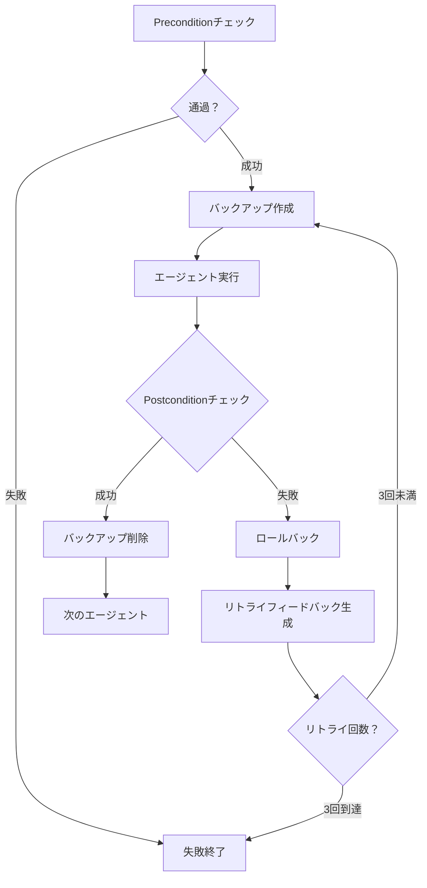

[前回の記事](/ja/blog/2026/01/06/ai-agent-pipeline-7-shell-orchestration/)では、パイプラインの正常実行フローを扱いました。

今回は、**失敗したときどう処理したか**をまとめました。

<!--more-->

## 1. 初期アプローチの限界

[4編](/ja/blog/2025/12/22/ai-agent-pipeline-4-content-validator/)で言及した初期アプローチです。非決定的なLLMの意味評価50点、決定的なスクリプトの構造検証50点で100点満点中90点以上なら通過、未達ならリトライしました。

パイプライン全体を実行した後、最後のcontent-validatorがスコアを判断しました。未達なら`IMPROVEMENT_NEEDED`マーカーをファイルに残した後、最初からやり直しました。各エージェントは自分に該当する改善事項があれば反映し、なければスキップする方式でした。

しかし、この方式は正しく動作しませんでした：

- 改善事項を無視して既存の作業を繰り返す
- 指摘されていない部分まで過剰修正
- ハンドオフログが長くなるにつれIMPROVEMENT_NEEDEDを見逃す
- 以前のエラーが残った状態で継続
- 同じ問題で未達が続きリトライを繰り返す

ファイルマーカーでは伝えられる内容が限定的で、多くのハンドオフログの中から改善事項だけを正確に読んで反映するのは難しかったようです。既存ファイルの上に上書きする方式では解決できませんでした。

---

## 2. 解決方向

2つを変更しました。

まず、検証タイミングをパイプラインの最後から各エージェント実行前後に移しました。前のエージェントがすべきことをPreconditionでチェックし、現在のエージェントがすべきことをPostconditionでチェックします。

次に、失敗時にファイルにマーカーを残す代わりにバックアップにロールバックします。フィードバックはファイルマーカーではなくコンテキストに直接渡します。

---

## 3. Precondition/Postcondition検証

各エージェントが実行される前に、前のエージェントがすべきことが完了したかチェックしました。これがPreconditionです。例えばconcepts-writerが実行される前に`# Overview`セクションが存在するか確認しました。なければエージェントを実行せず失敗処理しました。

エージェントが実行された後は、そのエージェントがすべきことが完了したかチェックしました。これがPostconditionです。overview-writerの場合、`# Overview`セクションが存在するか、CURRENT_AGENTが次のエージェントであるconcepts-writerに更新されたか、HANDOFF LOGに完了記録が残ったか確認しました。

concepts-writerはより多くの条件をチェックしました。`# Core Concepts`セクションが存在するか、Conceptブロックが3-5個か、各ConceptにEasy/Normal/Expertセクションがすべてあるか、コードブロックが正しく閉じられているかまで確認しました。

この検証はスクリプトで行うので結果が一貫しています。LLMが判断するのではなくルールベースでチェックするため、同じファイル状態では常に同じ結果が出ます。

| エージェント | Precondition例 | Postcondition例 |
|:---|:---|:---|
| overview-writer | CURRENT_AGENT == overview-writer | `# Overview`存在、CURRENT_AGENT → concepts-writer |
| concepts-writer | `# Overview`存在 | `# Core Concepts`存在、Concept 3-5個 |
| visualization-writer | `# Core Concepts`存在 | ビジュアライゼーションコンポーネント生成 |

実際にはエージェントごとに10-14個の検証項目があります。

---

## 4. バックアップ/ロールバックとリトライフィードバック

Postcondition検証が失敗したときが問題でした。ファイルにマーカーを残して次に進むと、間違った内容が蓄積されます。そこでエージェント実行前にファイルをバックアップしておき、検証が失敗したらバックアップに復元してからリトライします。検証が通過したらバックアップを削除して次のエージェントに進みます。

最初はロールバックだけすればいいと思いました。ファイルを復元したのだから、また作業すればいいのでは？しかしリトライしてもドキュメントが正しく修正されませんでした。

CLI出力ログを確認したところ原因がわかりました。エージェントが「すでに作業を完了した」と応答していました。7編で扱ったようにセッションを共有しているので、ファイルはロールバックされてもセッションコンテキストには以前の作業履歴がそのまま残っています。エージェントの立場からは、たった今作業を終えたのに同じリクエストがまた来たことになります。

そこでリトライ時にプロンプトにフィードバックを追加しました。

```bash
[RETRY ATTEMPT $attempt_num/$MAX_RETRIES]

⚠️  ROLLBACK PERFORMED
Your previous output failed postcondition validation and has been rolled back.
The target file has been restored to its state BEFORE your last execution.

Validation errors from previous attempt:
$retry_feedback
```

フィードバックの核心は3つです。第一に、ロールバックが実行されたこと。第二に、ファイルが以前の状態に復元されたこと。第三に、どの検証が失敗したか。この情報があれば、エージェントはコンテキストに残っている以前の作業履歴と現在のファイル状態が異なることを認識できます。

こうするとエージェントが状況を理解して再び作業を始めました。「すでにやった」と応答する代わりに、失敗した検証項目を確認してその部分を修正しました。

---

## 5. 全体フローチャート

これまで説明した内容をまとめると、各エージェントは次のフローで実行されます。リトライは最大3回まで許可され、3回すべて失敗するとパイプラインを終了します。



---

## 6. まとめ

最初は疑問がありました。失敗を処理するロジックを作るということは失敗を想定するということですが、それよりもそもそも失敗しないようにするのが正しいのでは？

しかしLLM接続が切れたり使用が中断されるケースがあり、同じ入力でも異なる出力が出る非決定的特性もありました。検証とリトライは選択ではなく必須でした。

次回はパイプラインを仕上げながら発見したことを扱います。

---

> このシリーズはAI-DLC（AI-Driven Development Lifecycle）方法論を実際のプロジェクトに適用した経験を共有します。
> AI-DLCの詳細については、[経済指標ダッシュボード開発記シリーズ](/ja/blog/2025/10/06/economic-dashboard-1-why-started/)をご参照ください。
