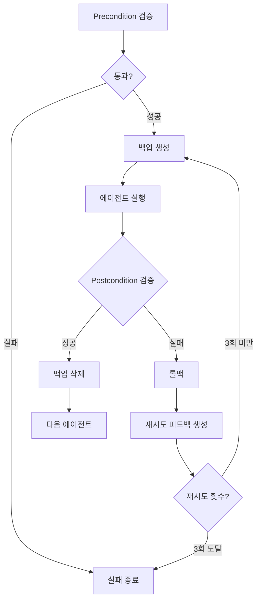

[지난 편](/blog/2026/01/06/ai-agent-pipeline-7-shell-orchestration/)에서는 파이프라인 정상 실행 흐름을 다뤘습니다.

이번 편에서는 **실패했을 때 어떻게 처리했는지** 정리해봤습니다.

<!--more-->

## 1. 초기 접근 방식의 한계

[4편](/blog/2025/12/22/ai-agent-pipeline-4-content-validator/)에서 언급한 초기 접근 방식입니다. 비결정적인 LLM의 의미 평가 50점, 결정적인 스크립트의 구조 검증 50점으로 100점 만점에 90점 이상이면 통과, 미달이면 재시도했습니다.

파이프라인 전체를 실행한 후 마지막 content-validator가 점수를 판단했습니다. 미달이면 `IMPROVEMENT_NEEDED` 마커를 파일에 남긴 뒤 처음부터 다시 시작했습니다. 각 에이전트는 자신에게 해당하는 개선 사항이 있으면 반영하고, 없으면 스킵하는 방식이었습니다.

하지만 이 방식은 제대로 동작하지 않았습니다:

- 개선 사항을 무시하고 기존 작업 반복
- 지적받지 않은 부분까지 과잉 수정
- 핸드오프 로그가 길어지면서 IMPROVEMENT_NEEDED를 놓침
- 이전 오류가 남아있는 상태에서 계속 진행
- 같은 문제로 계속 미달되어 재시도 반복

파일 마커로는 전달할 수 있는 내용이 한정적이고, 많은 핸드오프 로그 사이에서 개선 사항만 정확히 읽고 반영하기 어려웠을 것으로 보입니다. 기존 파일 위에 덧씌우는 방식으로는 해결할 수 없었습니다.

---

## 2. 해결 방향

두 가지를 변경했습니다.

첫째, 검증 시점을 파이프라인 끝에서 각 에이전트 실행 전후로 옮겼습니다. 이전 에이전트가 해야 할 것들을 Precondition으로 체크하고, 현재 에이전트가 해야 할 것들을 Postcondition으로 체크합니다.

둘째, 실패 시 파일에 마커를 남기는 대신 백업으로 롤백합니다. 피드백은 파일 마커가 아니라 컨텍스트에 직접 전달합니다.

---

## 3. Precondition/Postcondition 검증

각 에이전트가 실행되기 전에 이전 에이전트가 해야 할 것들이 완료되었는지 체크했습니다. 이것이 Precondition입니다. 예를 들어 concepts-writer가 실행되기 전에 `# Overview` 섹션이 존재하는지 확인했습니다. 없으면 에이전트를 실행하지 않고 실패 처리했습니다.

에이전트가 실행된 후에는 해당 에이전트가 해야 할 것들이 완료되었는지 체크했습니다. 이것이 Postcondition입니다. overview-writer의 경우 `# Overview` 섹션이 존재하는지, CURRENT_AGENT가 다음 에이전트인 concepts-writer로 업데이트되었는지, HANDOFF LOG에 완료 기록이 남았는지 확인했습니다.

concepts-writer는 더 많은 조건을 체크했습니다. `# Core Concepts` 섹션이 존재하는지, Concept 블록이 3-5개인지, 각 Concept에 Easy/Normal/Expert 섹션이 모두 있는지, 코드 블록이 제대로 닫혔는지까지 확인했습니다.

이 검증은 스크립트로 수행하므로 결과가 일관됩니다. LLM이 판단하는 것이 아니라 규칙 기반으로 체크하기 때문에, 같은 파일 상태에서는 항상 같은 결과가 나옵니다.

| 에이전트 | Precondition 예시 | Postcondition 예시 |
|:---|:---|:---|
| overview-writer | CURRENT_AGENT == overview-writer | `# Overview` 존재, CURRENT_AGENT → concepts-writer |
| concepts-writer | `# Overview` 존재 | `# Core Concepts` 존재, Concept 3-5개 |
| visualization-writer | `# Core Concepts` 존재 | 시각화 컴포넌트 생성 |

실제로는 에이전트별로 10-14개의 검증 항목이 있습니다.

---

## 4. 백업/롤백과 재시도 피드백

Postcondition 검증이 실패했을 때가 문제였습니다. 파일에 마커를 남기고 다음으로 넘어가면 잘못된 내용이 누적됩니다. 그래서 에이전트 실행 전에 파일을 백업해두고, 검증이 실패하면 백업으로 복원한 뒤 재시도합니다. 검증이 통과하면 백업을 삭제하고 다음 에이전트로 넘어갑니다.

처음에는 롤백만 하면 될 거라고 생각했습니다. 파일을 복원했으니 다시 작업하면 되지 않을까요? 하지만 재시도해도 문서가 제대로 수정되지 않았습니다.

CLI 출력 로그를 확인해보니 원인을 알 수 있었습니다. 에이전트가 "이미 작업을 완료했다"고 응답하고 있었습니다. 7편에서 다뤘듯이 세션을 공유하고 있으니, 파일은 롤백되어도 세션 컨텍스트에는 이전 작업 내역이 그대로 남아있습니다. 에이전트 입장에서는 방금 작업을 끝냈는데 같은 요청이 또 들어온 셈입니다.

그래서 재시도할 때 프롬프트에 피드백을 추가했습니다.

```bash
[RETRY ATTEMPT $attempt_num/$MAX_RETRIES]

⚠️  ROLLBACK PERFORMED
Your previous output failed postcondition validation and has been rolled back.
The target file has been restored to its state BEFORE your last execution.

Validation errors from previous attempt:
$retry_feedback
```

피드백의 핵심은 세 가지입니다. 첫째, 롤백이 수행되었다는 것. 둘째, 파일이 이전 상태로 복원되었다는 것. 셋째, 어떤 검증이 실패했는지. 이 정보가 있으면 에이전트는 컨텍스트에 남아있는 이전 작업 내역과 현재 파일 상태가 다르다는 것을 인식할 수 있습니다.

이렇게 하니 에이전트가 상황을 이해하고 다시 작업을 시작했습니다. "이미 했다"고 응답하는 대신, 실패한 검증 항목을 확인하고 해당 부분을 수정했습니다.

---

## 5. 전체 흐름도

지금까지 설명한 내용을 정리하면, 각 에이전트는 다음 흐름으로 실행됩니다. 재시도는 최대 3회까지 허용되며, 3회 모두 실패하면 파이프라인을 종료합니다.



---

## 6. 마무리

처음에는 의문이 있었습니다. 실패를 처리하는 로직을 만든다는 건 실패를 가정한다는 뜻인데, 그보다는 아예 실패하지 않게 만드는 게 맞지 않을까?

하지만 LLM 연결이 끊기거나 사용이 중단되는 경우가 있었고, 같은 입력에도 다른 출력이 나오는 비결정적 특성도 있었습니다. 검증과 재시도는 선택이 아니라 필수였습니다.

다음 편에서는 파이프라인을 마무리하며 발견한 것들을 다룹니다.

---

> 이 시리즈는 AI-DLC(AI-assisted Document Lifecycle) 방법론을 실제 프로젝트에 적용한 경험을 공유합니다.
> AI-DLC에 대한 자세한 내용은 [경제지표 대시보드 개발기 시리즈](/blog/2025/10/06/economic-dashboard-1-why-started/)를 참고해주세요.
