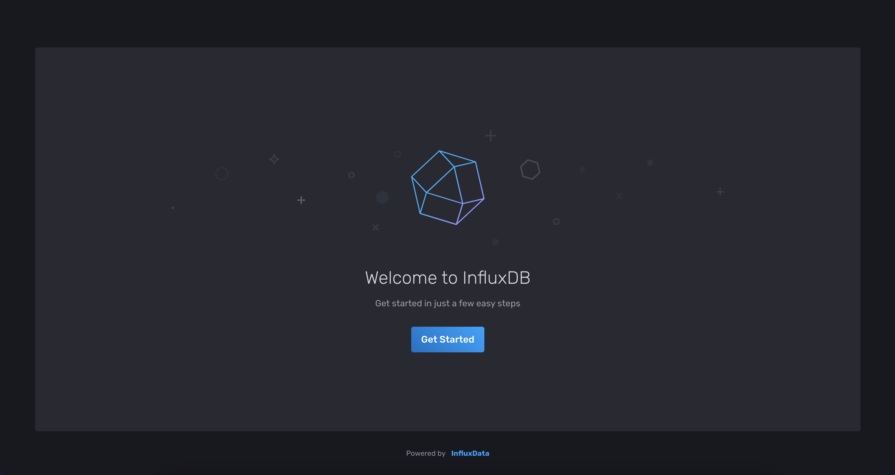
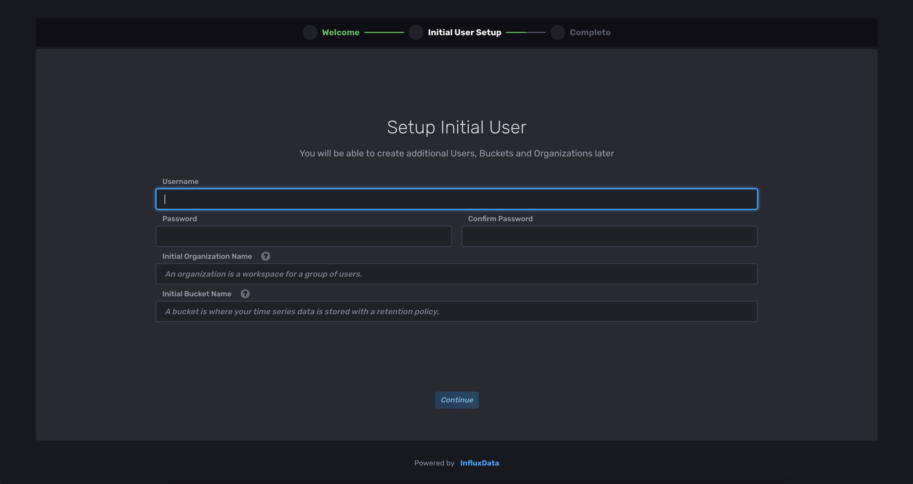
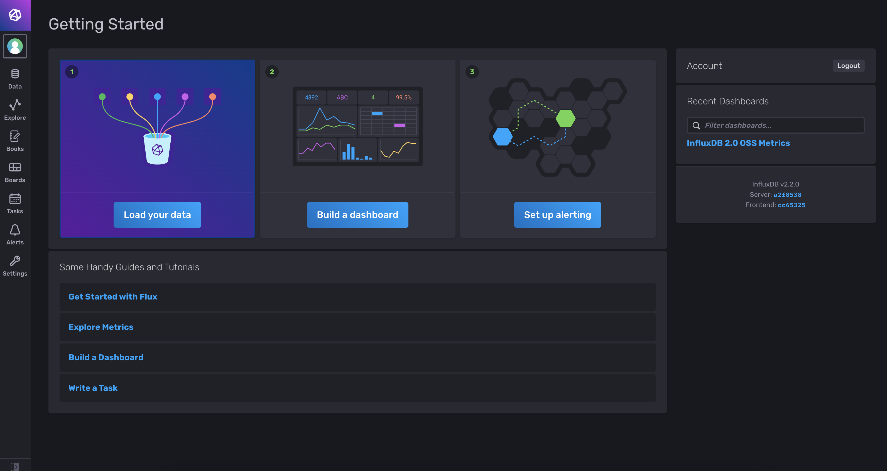
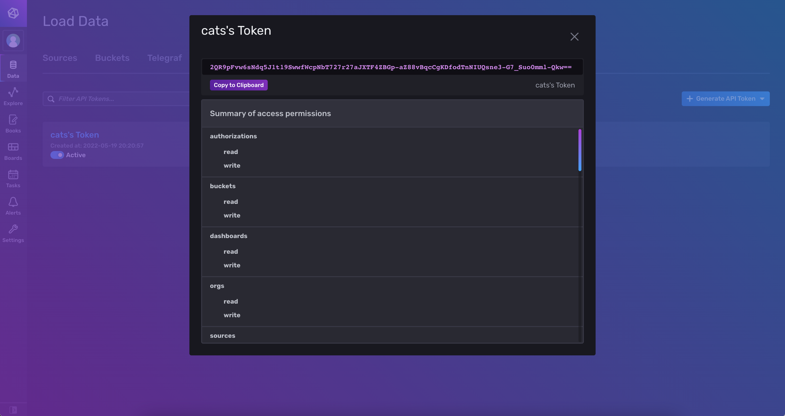
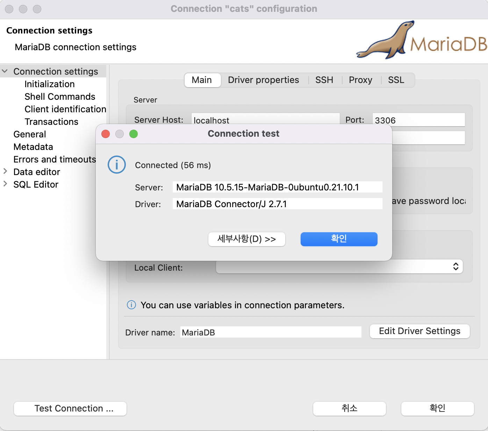
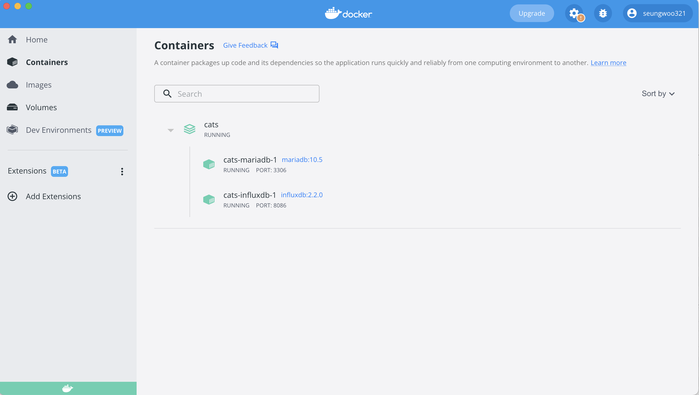

# 프론트엔드 개발자의 Docker 입문기

[[toc]]

## 들어가기 전에

트레이딩 봇 애플리케이션 구동에 필요한 복잡하고 번거로운 설정 과정을 자동화하기 위한 힌트를 얻기 위해서 깃허브의 Topics에 `trading bot`을 검색해 보니 깃허브 스타(Star) 수가 1k 이상인 프로젝트들은 대부분 도커(Docker)와 관련된 설정이 포함되어 있는 것을 알 수 있었습니다. 그래서 도커를 시작하게 되었고 우분투 컨테이너(Container)에 봇 애플리케이션 구동 환경을 구성하면서 겪은 문제들과 최종적으로 도커를 프로젝트에 적용해서 배포까지해 본 과정을 정리했습니다.

### 개발 환경

v2.0을 리팩토링 한 트레이딩 봇(Trading bot) 애플리케이션 캣츠(cats)는 다음 환경에서 동작합니다.

- InfluxDB 2.2
- MariaDB 10.5
- Node.js 16.15.0

이 환경을 구성한 다음에는 실행되는 봇 애플리케이션에서 거래소부터 받은 시장 데이터를 인플럭스디비(InfluxDB)에 저장하기 위해 쓰기 권한이 있는 토큰과 저장소가 되는 버킷 이름이 필요합니다. 포지션 상태 값을 관리하고 거래내역에 대한 데이터 저장은 마리아 디비(MariaDB)를 쓰기 때문에 마리아 디비의 접속 정보도 필요합니다. 또 거래소에 자동주문을 생성하기 위해 거래소부터 발급받은 ApiKey, SecretKey 값과 종목에 대한 정보 들도 환경 변수로 참조하고 있어야 합니다.

## 하나의 컨테이너에 구성

### ubunut 21.10 컨테이너 실행

먼저 도커 허브(Docker Hub)에서 새로운 도커 이미지의 기본이 될 우분투(Ubuntu) 공식 이미지를 가져와서 컨테이너를 실행합니다.

(2022.05.07 기준)
`docker pull ubunut`명령어를 실행하면 최신 버전의 우분투 이미지 Ubuntu 22.04 LTS를 가져오는데 mariadb-server를 설치하고 서비스 시작을 하면 서비스 실행이 실패합니다. mariadb 설치 가이드 문서를 확인해 보니 우분투 21.10까지만 지원되기 때문이었습니다.

```bash
# outside container
docker pull ubunut:21.10
docker run --name cats -it ubuntu:21.10 bash
```

### mariadb 10.5 설치

마리아 디비를 설치 후 서비스를 실행하고 다음 사이트의 output을 참고해서 보안 설정을 진행합니다.

><https://www.eddycyu.dev/blog/how-to-install-mariadb-via-docker-on-ubuntu-20.04-lts>

설치

```bash
# inside container
apt update -y
apt install mariadb-server
```

mariadb 서비스 실행

```bash
# inside container
service mariadb start 
```

보안 설정

```bash
# inside container
mysql_secure_installation
```

### InfluxDB 2.2 설치

공식 문서의 설치 안내에 따라서 다음 사이트에서 버전과 플랫폼을 선택합니다.

> <https://portal.influxdata.com/downloads/>

- Version: InfluxDB V2.2.0
- Platform: Ubunut & Debina

이 글에서 처럼 우분투 이미지로 시작한 컨테이너의 경우 아무것도 설치된 것이 없기 때문에 안내해 주는 데로 명령어를 실행해도 `command not found` 오류가 발생합니다. 당황하지 말고 실행에 필요한 명령어와 관련된 패키지들을 설치 후 진행해 주면 잘됩니다.

command not found 오류 해결을 위한 패키지 설치

```bash
# inside container
apt install sodo wget gpg lsb-release -y
```

InfluxDB 2.2 설치 명령어

```bash
# inside container
wget -qO- https://repos.influxdata.com/influxdb.key | gpg --dearmor | sudo tee /etc/apt/trusted.gpg.d/influxdb.gpg > /dev/null
export DISTRIB_ID=$(lsb_release -si); export DISTRIB_CODENAME=$(lsb_release -sc)
echo "deb [signed-by=/etc/apt/trusted.gpg.d/influxdb.gpg] https://repos.influxdata.com/${DISTRIB_ID,,} ${DISTRIB_CODENAME} stable" | sudo tee /etc/apt/sources.list.d/influxdb.list > /dev/null

sudo apt-get update && sudo apt-get install influxdb2
```

influxdb 서비스 실행

```bash
# inside container
service influxdb start
```

### Node.js

버전 관리를 위해 nvm을 사용해서 node.js를 설치합니다. npm 7.x 버전 이후부터 사용이 가능하게 된 workspace 기능을 사용하기 위해서 npm 8.5.5를 사용하는 node.js 16버전을 선택했습니다.

nvm 설치

```bash
# inside container
wget -qO- https://raw.githubusercontent.com/nvm-sh/nvm/v0.39.1/install.sh | bash
source .bashr
```

node.js 16 설치

```bash
# inside container
nvm install 16
node -v
```

### 컨테이너 커밋

트레이딩 봇 애플리케이션을 실행하는데 필요한 패키지 설치가 완료되었습니다. 여기까지 작업한 내용을 저장하기 위해서 컨테이너를 종료하고 커밋 명령어로 새 이미지를 생성했습니다.

```bash
# inside container
exit

# outside container
$ docker ps -a
CONTAINER ID   IMAGE          COMMAND                  CREATED             STATUS                        PORTS     NAMES
2cef8289d756   ubuntu:21.10   "bash"                   About an hour ago   Exited (0) 8 seconds ago                cats

$ docker commit cats cats # docker commit [컨테이너 이름] [저장할 이미지 이름]
sha256:16617d12090f92f9800421cb3578d23dadfe1d8ad892cdab2d616b75bf2050d1

$ docker images
REPOSITORY   TAG       IMAGE ID       CREATED              SIZE
cats         latest    16617d12090f   About a minute ago   930MB
```

## 서비스 설정 및 테스트

새로 만든 이미지로 포트 바인딩 옵션을 주고 dev라는 이름으로 컨테이너를 실행했습니다. 각 서비스 별로 설정을 위해서 서비스를 실행합니다.

```bash
# outside container
docker run --name dev -p 8086:8086 -p 3306:3306 -it cats:latest bash

# inside container
service mariadb start
service influxdb start
```

### InfluxDB 2.2 초기 설정

<http://localhost:8086>로 접속하거나 CLI 명령어를 사용해서 초기 설정을 진행할 수 있습니다. 트레이딩 봇 애플리케이션에는 환경 변수로 인플럭스 디비에 데이터를 쓰기 위한 토큰(token) 설정이 필요한데 웹 브라우저에서 초기 설정을 하게 되면 랜덤으로 토큰 값이 생성되고 로그인 후에 웹 페이지에서 확인할 수 있습니다.

<div style="display:flex;">
  
  
</div>
<div style="display:flex;">
  
  
</div>

다음과 같이 CLI를 사용하면 강제로 토큰 값을 지정할 수 있어서 자동화에는 이 방법이 유용합니다.

```bash
# inside container
influx setup \
  --org cats \
  --bucket cats \
  --username cats \
  --password root@cats \
  --token cats \
  --force  
```

### mariadb 10.5 데이터베이스 생성

10.4부터는 별도로 root 패스워드를 설정하지 않아도 **unix_socket** 방식으로 접근이 가능해서 `sudo mysql` 명령어로 데이터베이스에 접속할 수 있습니다. 우분투 이미지를 기본으로 한 컨테이너에서 별도의 사용자를 만들지 않았고 root 사용자로 작업하고 있으니 `sudo`는 생략하고 `mysql` 명령어로 진입하여 애플리케이션에서 사용할 데이터베이스와 사용자 및 패스워드를 생성하고 권한을 부여합니다.

```bash
# inside container
mysql # or sudo mysql
```

데이터 베이스 및 사용자 생성

```sql
CREATE DATABASE IF NOT EXISTS cats DEFAULT CHARACTER SET utf8 COLLATE utf8_general_ci;
use cats;
CREATE USER IF NOT EXISTS cats@'localhost' IDENTIFIED BY 'cats';
GRANT ALL PRIVILEGES ON cats.* TO 'cats'@'localhost' IDENTIFIED BY 'cats';
flush privileges;
```

### 호스트PC에서 컨테이너의 mariadb 10.5로 로컬호스트 접속 에러 (1)

컨테이너를 실행하고 있는 호스트(Host) PC에서 DBeaver을 사용해서 localhost의 3306 포트로 연결을 시도했으나 실패했습니다.


> unexpected end of stream, read 0 bytes from 4 (socket was closed by server)

첫 번째로 컨테이너 안에서 netstat 명령어로 3306 포트가 LISTEN 상태인지를 확인해 볼 필요가 있습니다. netstat 명령어가 없으면 설치합니다.

```bash
# inside container
sudo apt-get install net-tools # if not exist command
netstat -lnp | grep 3306 # 3306 port open check
```

두 번째로 컨테이너 밖에서 docker ps 명령어나 Docker Desktop에서 호스트 운영체제와 컨테이너 환경의 포트 포워딩 설정이 잘 되어있는지를 확인합니다. 확인되지 않는다면 -p 옵션을 주고 컨테이너를 다시 실행합니다.

세 번째로 위에서 언급했듯이 기본적으로 로컬에서는 **unix_socket** 방식으로 접근하기 때문에 외부에서의 원격 tcp 연결이 막혀있는지를 확인하면 됩니다. bind-address이 설정된 라인의 맨 앞에 #을 추가해서 주석 처리를 해주거나 0.0.0.0으로 수정하면 됩니다. MariaDB 공식 이미지 도커 파일에서 관련 설정을 해주는 명령어를 확인할 수 있었습니다. 다음 링크의 L123-L125의 명령어를 보면 sed 명령어로 /etc/mysql/ 폴더 하위에 있는 *.cnf 파일 중에서 bind-address|log|user로 시작하는 라인들을 찾아서 주석 처리하는 것을 알 수 있습니다.

[link - MariaDB 공식 이미지 Dockerfile L123-L125](https://github.com/MariaDB/mariadb-docker/blob/cb0bb9ac8d442f4d227fc2ffeaf8d7eb3abbb7ec/10.5/Dockerfile#L123-L125)

```bash
# inside container
find /etc/mysql/ -name '*.cnf' -print0 \
    | xargs -0 grep -lZE '^(bind-address|log|user\s)' \
    | xargs -rt -0 sed -Ei 's/^(bind-address|log|user\s)/#&/';
```

설정이 변경한 후에는 반드시 서비스를 재시작 합니다.

```bash
# inside container
service mariadb restart
```

### 호스트PC에서 컨테이너의 mariadb 10.5로 로컬호스트 접속 에러 (2)

다시 DBeaver에서 localhost:3306으로 연결을 시도하니 이전 오류는 해결이 되었지만 새로운 오류 메시지가 출력 됩니다.


> Host '172.17.0.1' is not allowed to connect to this MariaDB server

```bash
# inside container
docker inspect dev # docker inspect [CONTAINER_ID / CONTAINER_NAME]
.
.
            "Gateway": "172.17.0.1",
            "GlobalIPv6Address": "",
            "GlobalIPv6PrefixLen": 0,
            "IPAddress": "172.17.0.2",
.
.
```

`docker inspect` 명령어로 살펴보면 알 수 있듯이 프라이빗 아이피 172.17.0.1은 컨테이너를 실행하는 호스트 PC에 연결을 허용하는 도커 게이트웨이 IP 값이고 dev 컨테이너에는 172.17.0.2가 할당되어 있습니다.

위 오류 메시지는 도커 게이트웨이 아이피에서 데이터베이스 접근이 허용되지 않는다는 것이므로 이 아이피로 데이터베이스와 계정에 접근할 수 있도록 권한을 주면 됩니다.

```bash
# inside container
mysql # or sudo mysql
```

```sql
GRANT ALL PRIVILEGES ON cats.* TO 'cats'@'172.17.0.1' IDENTIFIED BY 'cats';
flush privileges;
```

연결이 성공했습니다.



## Dockerfile로 구성

하나의 컨테이너로 구성한 커스텀 이미지를 사용해서 개발환경을 쉽게 테스트 할 수있었습니다. 하지만 공식문서를 읽어보면 하나의 컨테이너에서는 하나의 프로세스만 관리하는 멀티 컨테이너 전략을 권장합니다. 그래서 Dockerfile로 각각 다시 구성해 보기로 했습니다.

### 도커파일 작성

[Docker Hub](https://hub.docker.com/search?q=)에서 influxdb와 mariadb가 이미 설치되어 있는 공식 이미지를 찾을 수 있습니다. 이 이미지를 기반으로 데이터베이스와 계정등을 생성하는 도커 파일을 작성했습니다.

#### Dockerfile.mariadb

먼저 mariadb를 가이드 문서를 보고 작성 했습니다.

```Dockerfile
FROM mariadb:10.5

ENV MARIADB_ALLOW_EMPTY_ROOT_PASSWORD=yes
ENV MARIADB_DATABASE=cats
ENV MARIADB_USER=cats
ENV MARIADB_PASSWORD=cats

COPY entry-mariadb.sql /docker-entrypoint-initdb.d/

EXPOSE 3306
```

entry-mariadb.sql은 [컨테이너에 개발 환경 구성하기의 mariadb 10.5 데이터베이스 생성](#mariadb-10-5-데이터베이스-생성)의 SQL을 담고 있습니다. 공식 이미지에서 설명하는 확장자와 일치하도록 해서`/docker-entrypoint-initdb.d`에 파일을 위치시키면 알파벳 순서대로 실행된다고 합니다.

::: details

```sql
CREATE DATABASE IF NOT EXISTS cats DEFAULT CHARACTER SET utf8 COLLATE utf8_general_ci;
use cats;
CREATE USER IF NOT EXISTS cats@'localhost' IDENTIFIED BY 'cats';
GRANT ALL PRIVILEGES ON cats.* TO 'cats'@'localhost' IDENTIFIED BY 'cats';
flush privileges;
```

:::

#### Dockerfile.inlfuxdb

inlfuxdb도 같은 방식으로 작성을 했습니다.

```Dockerfile
FROM influxdb:2.2.0

ENV DOCKER_INFLUXDB_INIT_MODE=setup
ENV DOCKER_INFLUXDB_INIT_USERNAME=cats
ENV DOCKER_INFLUXDB_INIT_PASSWORD=cats@root
ENV DOCKER_INFLUXDB_INIT_ORG=cats
ENV DOCKER_INFLUXDB_INIT_BUCKET=cats
ENV DOCKER_INFLUXDB_INIT_ADMIN_TOKEN=cats

COPY entry-influxdb.sh /docker-entrypoint-initdb.d/

EXPOSE 8086
```

entry-influxdb.sh는 지원하는 거래소 이름별로 버킷을 생성하는 CLI 명령어들을 실행하는 스크립트입니다. 설치 과정 중 생성하는 최초 버킷 외에 거래소별로 캔들 데이터를 구분하여 저장하기 위한 용도로 캔들 데이터를 수집하기 전에 미리 생성되어야 합니다.

::: details

```bash
#!/bin/bash

set -e

CATS_PRODUCTION_EXCHANGES=("bitmex" "binance" "upbit")
CATS_TESTNET_EXCHANGES=("bitmex" "binance")

echo "create bucket for production..."

for exchange in "${CATS_PRODUCTION_EXCHANGES[@]}"; do
  echo $exchange
  influx bucket create -n $exchange -o $DOCKER_INFLUXDB_INIT_ORG -t $DOCKER_INFLUXDB_INIT_ADMIN_TOKEN
done

echo "create bucket for testnet..."

for testnet in "${CATS_TESTNET_EXCHANGES[@]}"; do
echo $testnet.test
  influx bucket create -n $testnet.test -o $DOCKER_INFLUXDB_INIT_ORG -t $DOCKER_INFLUXDB_INIT_ADMIN_TOKEN
done

echo ""
echo "init-influxdb.sh execution completed."
echo ""

```

:::

이러한 추가 CLI 실행에는 최초 기본 계정 및 버킷 설정이 완료된 이후 시점에 생성되는 인증 토큰이 필요하고 influxdb 서비스도 실행 중이어야 합니다.

[InfluxDB 2.2 초기 설정](#influxdb-2-2-초기-설정)에서 수동으로 진행했던것과는 달리 Dockerfile을 빌드 시 entry-influxdb.sh를 실행하려면 어떻게 해야 되는지 정말 많은 고민을 했습니다.

사실 mariadb처럼 influxdb도 /docker-entrypoint-initdb.d에 대한 설명이 있었지만 이 부분을 놓쳤습니다.

그래서 influxdb 이미지 빌드 과정의 어느 부분에 스크립트를 끼워 넣어야 하는지 파악하기 위해  깃허브에서 influxdb의 공식 Dockerfile을 살펴봤습니다. `ENTRYPOINT`에 entrypoint.sh 스크립트가 지정되어 있었고 이걸 열어보니 사용자가 설정한 환경 변수에 따라서 `1.x 버전에서 업그레이드`하거나 `2.x 버전에서 기본 사용자 및 버킷 생성`을 한 다음 /docker-entrypoint-initdb.d에 위치한 `사용자 정의 스크립트를 실행`하는 내용이 포함돼 있는 걸 보고 확실하게 이해할 수 있었습니다.

entrypoint.sh에서의 각 기능과 관련된 코드는 다음과 같습니다.

- `1.x 버전에서 업그레이드` - [upgrade_influxd: L280, L147~187](https://github.com/influxdata/influxdata-docker/blob/e7469c2eae8f6a3dd50a2fbdea64aacde372cc74/influxdb/2.2/entrypoint.sh#L280)
- `2.x 버전에서 기본 사용자 및 버킷 생성` - [setup_influxd: L318, L212~L229](https://github.com/influxdata/influxdata-docker/blob/e7469c2eae8f6a3dd50a2fbdea64aacde372cc74/influxdb/2.2/entrypoint.sh#L318)
- `사용자 정의 스크립트를 실행` - [run_user_scripts: L322, L253~L258](https://github.com/influxdata/influxdata-docker/blob/e7469c2eae8f6a3dd50a2fbdea64aacde372cc74/influxdb/2.2/entrypoint.sh#L322)

### 도커파일 빌드하기

Dockerfile과 각 엔트리 스크립트/쿼리문 파일이 위치한 dockerfiles 디렉터리에서 다음처럼 빌드 명령어를 실행하면 새로운 도커 이미지가 생성됩니다. 태그를 지정하지 않으면 `<none>`으로 생성돼서 -t [이름:버전]으로 태그를 지정하고 작성한 도커 파일명이 Dockerfile이 아닌 경우에는 -f [도커파일]으로 파일명을 지정하면 됩니다. 컨텍스트는 로컬이라서 현재 위치를 지정했습니다.

```bash
# current location is dockerfiles/ .

docker build -t seungwoo321/cats_influxdb:1.0 -f Dockerfile.influxdb .

docker build -t seungwoo321/cats_mariadb:1.0 -f Dockerfile.mariadb . 
```

#### 컨텍스트를 깃허브 링크로 지정시 이슈 정리

<https://docs.docker.com/engine/reference/commandline/build/> 문서를 보면 컨텍스트를 깃허브로 지정하는 방법이 있습니다. 테스트를 하기위해 먼저 Dockerfile의 엔트리 스크립트/쿼리 파일을 깃허브에서 가져오도록 수정했고 이 문서를 참고해서 빌드 명령어를 작성 후 실행해 보았습니다. 그러면 이 문서의 "Note"에서 언급하는 것처럼 BuildKit의 이슈로 오류가 발생합니다. DOCKER_BUILDKIT을 사용하지 않는다는 의미로 0으로 값을 지정하면 오류는 해결이 되지만 빌드 할 때 시간이 오래 걸려서 좋은 방법은 아닌 것 같습니다.

- Dockerfile 수정

```Dockerfile
# Dockerfile.mariadb
...
# COPY entry-mariadb.sql /docker-entrypoint-initdb.d/
ADD https://raw.githubusercontent.com/Seungwoo321/cats/master/dockerfiles/entry-mariadb.sql /docker-entrypoint-initdb.d/
...

# Dockerfile.influxdb
COPY entry-influxdb.sh /docker-entrypoint-initdb.d/


```

- 빌드 명령어

```bash
docker build -t seungwoo321/cats_mariadb:1.0 -f dockerfiles/Dockerfile.mariadb github.com/Seungwoo321/cats.git#master:dockerfiles

docker build -t seungwoo321/cats_influxdb:1.0 -f dockerfiles/Dockerfile.influxdb github.com/Seungwoo321/cats.git#master:dockerfiles

```

- 결과는 오류 출력

> failed to solve with frontend dockerfile.v0: failed to read dockerfile: failed to load cache key: subdir not supported yet

- 해결한 빌드 명령어

```bash
DOCKER_BUILDKIT=0 docker build -t seungwoo321/cats_mariadb:1.0 -f dockerfiles/Dockerfile.mariadb github.com/Seungwoo321/cats.git#master:dockerfiles

DOCKER_BUILDKIT=0 docker build -t seungwoo321/cats_influxdb:1.0 -f dockerfiles/Dockerfile.influxdb github.com/Seungwoo321/cats.git#master:dockerfiles

```

### 이미지 배포

배포된 이미지는 [여기](https://hub.docker.com/u/seungwoo321)에서 확인할 수 있습니다.

```bash
docker image push seungwoo321/cats_mariadb:1.0

docker image push seungwoo321/cats_influxdb:1.0

```

### 컨테이너 실행

### Run Mariadb

```bash
docker run -d -p 3306:3306 -it --rm seungwoo321/cats_mariadb:1.0
```

### Run Influxdb

```bash
docker run -d -p 8086:8086 -it --rm seungwoo321/cats_influxdb:1.0
```

## Docker Compose로 구성

Docker Compose는 YAML 파일을 사용해서 다중 컨테이너 애플리케이션을 정의하고 실행할 수 있는 도구입니다.

배포 환경은 컨테이너별로 Dockerfile을 여러 개 관리하기보다는 하나의 파일로 작성해서 관리하고 한 번에 애플리케이션에 필요한 모든 서비스를 실행할 수 있도록 해서 조금 더 쉽게 트레이딩 봇 애플리케이션을 사용할 수 있도록 하고 싶습니다.

이전에 작성한 Dockerfile의 내용을 기반으로 다음과 같이 작성했습니다.

### YAML파일 작성

```yml
version: "3.9"
services:

  influxdb:
    image: influxdb:2.2.0
    restart: on-failure
    ports:
      - "8086:8086"
    expose:
      - "8086"
    environment:
      - DOCKER_INFLUXDB_INIT_MODE=setup
      - DOCKER_INFLUXDB_INIT_USERNAME=cats
      - DOCKER_INFLUXDB_INIT_PASSWORD=cats@root
      - DOCKER_INFLUXDB_INIT_ORG=cats
      - DOCKER_INFLUXDB_INIT_BUCKET=cats
      - DOCKER_INFLUXDB_INIT_ADMIN_TOKEN=cats
    networks:
      - internal
    volumes:
      - ./dockerfiles/entry-influxdb.sh:/docker-entrypoint-initdb.d/entry-influxdb.sh
      - ./data/influxdb2:/var/lib/influxdb2

  mariadb:
    image: mariadb:10.5
    restart: on-failure
    ports:
      - "3306:3306"
    expose:
      - "3306"
    environment: 
      - MARIADB_ALLOW_EMPTY_ROOT_PASSWORD=yes
      - MARIADB_DATABASE=cats
      - MARIADB_USER=cats
      - MARIADB_PASSWORD=cats
    networks:
      - internal
    volumes:
      - ./dockerfiles/entry-mariadb.sql:/docker-entrypoint-initdb.d/entry-mariadb.sql
      - ./data/mysql:/var/lib/mysql

networks:
  internal:
    driver: bridge
```

### 실행 및 결과

- 실행

```bash
docker compose up
```

- 결과

<div style="display:flex;">
  
</div>
<div style="display:flex;">
  
  
</div>

## Conclusion

트레이딩 봇을 깃허브에 오픈소스로 배포를 하니 봇을 구동하기 위해 처음 진행되어야 하는 데이터베이스의 셋업 과정이 너무 번거롭게 불편하게 느껴졌습니다. 이렇게 여러 개의 애플리케이션이나 서비스를 구동해야 하는 환경이라면 도커를 도입해 보는 게 아주 큰 도움이 될 것 같습니다.
